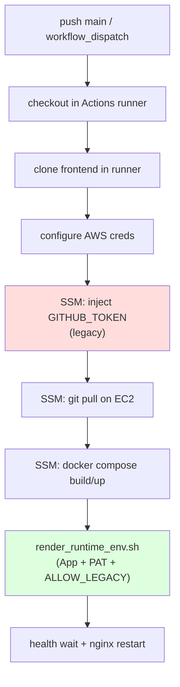

# Deploy Session Manager Workflow Review

**Date:** 2026-06-09  
**File:** `.github/workflows/deploy_session_manager.yml`  
**Related:** PR #32 (`fix/github-app-runtime-completion`), `deploy_all.sh`, `scripts/aws/render_runtime_env.sh`

---

## Workflow overview

| Property | Value |
|----------|-------|
| Name | Deploy to AWS EC2 (Session Manager) |
| Triggers | `push` to `main`, `workflow_dispatch` |
| Concurrency | `deploy-main` (cancel-in-progress) |
| Target instance | `i-087953603011543c5` (atp-rebuild-2026 PROD) |
| Project path on EC2 | `/home/ubuntu/automated-trading-platform` |
| Permissions | `contents: read` only (no repo write from GITHUB_TOKEN) |
| AWS auth | `AWS_ACCESS_KEY_ID` / `AWS_SECRET_ACCESS_KEY` repository secrets |

---

## Step-by-step auth and secrets analysis

### Step: PAT inject (lines 61–80)

```yaml
# Fetches /automated-trading-platform/prod/github_token
# Fallback: /openclaw/github-token
# Writes GITHUB_TOKEN to .env.aws AND secrets/runtime.env via sed/append
```

| Question | Answer |
|----------|--------|
| Uses GitHub Actions `GITHUB_TOKEN`? | **No** — uses EC2 instance IAM via SSM to read SSM Parameter Store |
| Required for container build? | **No** — build does not need GitHub PAT |
| Required for backend GitHub API after PR #32? | **Only during legacy transition** — `render_runtime_env.sh` also fetches PAT and sets `ALLOW_LEGACY_GITHUB_PAT` |
| Redundant with `render_runtime_env.sh`? | **Yes** — duplicate PAT write; render is authoritative for auth mode flags |

### Step: git pull + frontend clone (lines 82–136)

- Uses **public HTTPS** clone (`https://github.com/ccruz0/frontend.git`) — no PAT.
- Backend repo updated via `git pull origin main` on EC2 — assumes deploy keys or host credentials already configured (not this workflow).

### Step: docker rebuild (lines 138–228)

- Line 158: `bash scripts/aws/render_runtime_env.sh` — **this is the GitHub App-aware path** (PR #32).
- Comment still says "ensures GITHUB_TOKEN" — accurate today, should be updated post-cutover to "GitHub App + deploy secrets".
- On render failure: continues with existing `secrets/runtime.env` (warning only).

---

## Can this workflow coexist with PR #32?

**Yes.** No conflicts.

| PR #32 change | Workflow interaction |
|---------------|------------------------|
| `render_runtime_env.sh` writes `GITHUB_APP_*` + auth mode | Invoked at line 158 — **compatible** |
| Auto `ALLOW_LEGACY_GITHUB_PAT=true` when PAT-only | PAT inject (lines 61–80) ensures PAT exists before render; render adds flag |
| Runtime uses `get_github_api_token()` not raw PAT | Independent of workflow; needs correct `runtime.env` after render |
| `verify_deploy_secrets.sh` updated | **Not called** by workflow — gap for automated post-deploy verification |

**Ordering issue:** PAT inject runs **before** git pull. If PR #32 is on `main`, git pull brings new `render_runtime_env.sh`, then render runs with new logic. PAT inject still uses **old inline script** until workflow YAML is updated — harmless but redundant.

**Production today (`ATP_TRADING_ONLY=1`):** Deploy workflow behaviour unchanged; backend does not enforce GitHub auth at startup.

---

## Does PAT injection become redundant?

| Phase | PAT inject needed? |
|-------|-------------------|
| **Current prod** (PAT in SSM, no App) | **Partially redundant** — render also writes PAT; inject ensures PAT present even if render fails partially |
| **After PR #32 deploy + render** | **Redundant** for PAT content — render fetches same SSM path and sets `ALLOW_LEGACY_GITHUB_PAT` |
| **After App cutover** | **Obsolete** — should be **removed**; render alone writes `GITHUB_APP_*` |
| **After PAT deleted from SSM** | Inject step becomes no-op ("No token in SSM") — dead code |

**Recommendation:** Remove PAT inject block after GitHub App verified; until then, low risk to keep for belt-and-suspenders during transition.

---

## Is GitHub App deployment support missing?

| Capability | In workflow? | Notes |
|------------|--------------|-------|
| Fetch App creds from SSM | **Indirect** | Via `render_runtime_env.sh` only |
| Write App creds to runtime.env | **Indirect** | Same |
| Verify App auth after deploy | **Missing** | Should add `./scripts/verify_deploy_secrets.sh` (non-fatal or gated) |
| Create/configure GitHub App | **N/A** | Operator task outside workflow |
| Pass App secrets through GitHub Actions secrets | **Not used** | Correct — secrets stay in SSM on EC2 |
| Remove legacy PAT inject | **Not done** | Future cleanup |

**Gap:** Workflow has **no explicit GitHub App awareness** in YAML comments/steps except via render script side effect. No failure if App keys missing (continues with PAT path).

---

## Does deployment still target legacy paths?

| Legacy element | Still present? |
|----------------|----------------|
| SSM `/automated-trading-platform/prod/github_token` | **Yes** — inject + render |
| SSM `/openclaw/github-token` fallback | **Yes** — inject only |
| `.env.aws` GITHUB_TOKEN line | **Yes** — inject writes it |
| Direct `secrets/runtime.env` PAT append (bypass render flags) | **Yes** — inject may write PAT without `ALLOW_LEGACY_GITHUB_PAT` until render runs |
| `render_runtime_env.sh` legacy transition mode | **After PR #32 deploy** — fixes auth mode on line 158 |
| Workflow targets `deploy.yml` | **No** — correct primary workflow is self |
| SSH deploy `deploy.yml` | Legacy manual only — not triggered on push |

**Legacy path on EC2 directory name:** Workflow uses `automated-trading-platform` (not `crypto-2.0`) — consistent with production layout; not a PAT issue.

---

## Workflow diagram (current)



---

## Recommended workflow changes (future — not in this audit task)

| Priority | Change |
|----------|--------|
| P1 | Add post-deploy `./scripts/verify_deploy_secrets.sh \|\| true` with log capture |
| P2 | Remove PAT inject block once `auth_mode: github_app` stable |
| P3 | Update line 158 comment to reference GitHub App |
| P4 | Fail deploy if render fails when `GITHUB_AUTH_MODE=none` (optional, after cutover) |

---

## Verdict

| Criterion | Assessment |
|-----------|------------|
| Coexist with PR #32 | **Yes** — render step integrates App support |
| PAT inject redundant post-PR #32 | **Mostly yes** — keep briefly for transition |
| GitHub App support missing in YAML | **Partially** — logic delegated to render script; no verification step |
| Legacy paths | **Yes** — PAT inject + SSM `github_token` still active |
| Safe to merge PR #32 without workflow changes | **Yes** — no workflow code changes required for initial rollout |
| Safe to delete PAT from SSM without workflow changes | **No** — remove inject block and verify render first |
