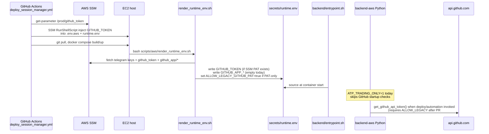
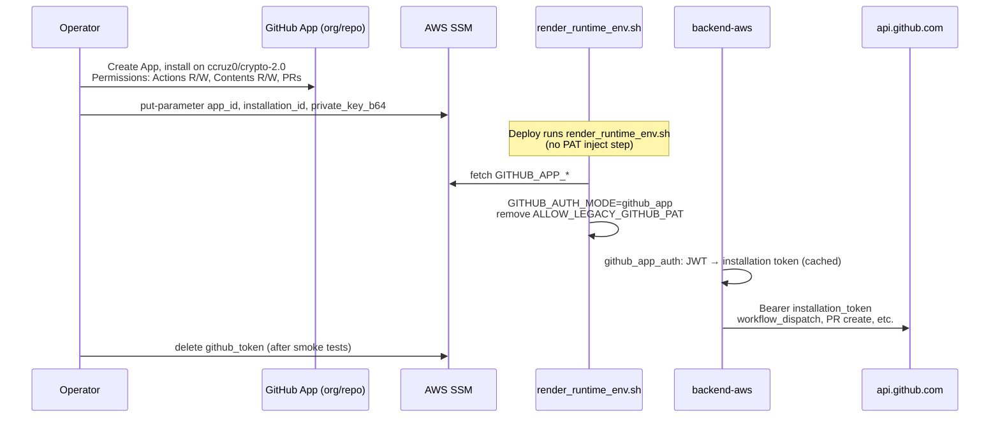

# GitHub App Cutover Plan

**Date:** 2026-06-09  
**Goal:** Safe transition from SSM personal PAT to GitHub App installation tokens without breaking production trading (`ATP_TRADING_ONLY=1` unchanged until deliberate enablement).

---

## Current auth flow

### Current production facts

| Item | State |
|------|-------|
| SSM `/automated-trading-platform/prod/github_token` | **Present** |
| SSM `/automated-trading-platform/prod/github_app/*` | **Absent** |
| `ALLOW_LEGACY_GITHUB_PAT` in prod runtime | **Absent** (manual inject may set PAT without flag) |
| `ATP_TRADING_ONLY` | **`1`** — automation/GitHub checks skipped at startup |
| PR #32 on branch | Runtime code ready; **not merged to main / not deployed** |
| GitHub App entity | **Not created** |

### Deploy path files (audited)

| Path | Role |
|------|------|
| `.github/workflows/deploy_session_manager.yml` | Primary push-to-main deploy via SSM |
| `.github/workflows/deploy.yml` | Legacy SSH deploy (manual only) |
| `deploy_all.sh` | Operator mirror of session-manager workflow |
| `deploy_github_token_ssm.sh` | One-off PAT push to EC2 |
| `scripts/aws/render_runtime_env.sh` | Renders `secrets/runtime.env` from SSM |
| `scripts/aws/*` (other) | No additional GitHub PAT logic found |
| `scripts/openclaw/*` | LAB only — no PROD backend PAT path |
| `backend/entrypoint.sh` | Sources `secrets/runtime.env` into process env |

---

## Future GitHub App flow

---

## Risks

| Risk | Severity | Mitigation |
|------|----------|------------|
| Merge PR #32 + deploy before App SSM exists | **High** if `ATP_TRADING_ONLY=0` | Keep `ATP_TRADING_ONLY=1` until App SSM populated; render script auto-sets `ALLOW_LEGACY_GITHUB_PAT` when PAT-only |
| Deploy with PAT but no `ALLOW_LEGACY_GITHUB_PAT` (pre-render) | **Medium** | Ensure deploy always runs `render_runtime_env.sh` (already in workflow line 158); remove redundant raw PAT inject or run render first |
| `ATP_TRADING_ONLY=0` without App or legacy flag | **High** | Backend `RuntimeError` at startup (`factory.py`) |
| GitHub App missing permissions | **High** | Grant `actions:write`, `contents:write`, `pull_requests:write`, `metadata:read` minimum |
| Installation token expiry / clock skew | **Low** | Cached with 120s buffer; auto-remint |
| Dual auth (PAT + App both present) | **Low** | App preferred; warning logged via `log_redundant_github_token_if_app_active()` |
| Premature PAT deletion from SSM | **High** | Delete only after `verify_deploy_secrets.sh` → `auth_mode: github_app` and smoke tests |
| Deploy workflow redundant PAT inject masks render failures | **Medium** | Consolidate on `render_runtime_env.sh` as single writer |

---

## Rollback plan

1. **Immediate (automation broken):** Set `ALLOW_LEGACY_GITHUB_PAT=true` in `secrets/runtime.env` (or re-run render with PAT in SSM); ensure `GITHUB_TOKEN` present; `docker compose --profile aws up -d --force-recreate backend-aws`.
2. **Code rollback:** Revert PR #32 or redeploy previous backend image from last known-good commit.
3. **SSM rollback:** Restore `/automated-trading-platform/prod/github_token` if deleted; re-run `render_runtime_env.sh`.
4. **Verify:** `./scripts/verify_deploy_secrets.sh` → `auth_mode: legacy_transition` or `legacy_pat`.
5. **GitHub App rollback:** Uninstall or disable App; no code change required if PAT path restored.

---

## Exact files requiring future changes

Post-cutover cleanup ( **do not change until App verified in prod** ):

| File | Change |
|------|--------|
| `.github/workflows/deploy_session_manager.yml` | Remove lines 61–80 PAT inject block; update comment on line 158 |
| `deploy_all.sh` | Remove PAT inject block (lines 44–64) |
| `deploy_github_token_ssm.sh` | Deprecate or archive |
| `scripts/set_github_token_for_deploy.sh` | Deprecate |
| `scripts/set_github_token_popup.py` | Deprecate |
| `scripts/aws/render_runtime_env.sh` | Optional: stop fetching/writing `GITHUB_TOKEN` after PAT revoked |
| `scripts/test_deploy_dispatch.sh` | Update to use App token or document legacy-only |
| `backend/scripts/test_deploy_dispatch.sh` | Same |
| `verificar_deploy.sh` | Point at `deploy_session_manager.yml`; use Bearer not `token` header |
| `backend/docs/GITHUB_APP_AUTH.md` | Remove transition section after cutover |
| `secrets/runtime.env.example` | Remove legacy PAT comments when fully migrated |

**No change required (already App-ready in PR #32):**

- `backend/app/services/github_app_auth.py`
- `backend/app/services/deploy_trigger.py`
- `backend/app/services/cursor_execution_bridge.py`
- `backend/app/api/routes_monitoring.py`
- `backend/app/factory.py`
- `scripts/verify_deploy_secrets.sh`

---

## Recommended cutover sequence (operator)

| Step | Action | Production behaviour change? |
|------|--------|------------------------------|
| 1 | Merge PR #32 | No until deploy |
| 2 | Create GitHub App + install on repo | No |
| 3 | Write SSM `github_app/*` parameters | No |
| 4 | Deploy via `deploy_session_manager.yml` | Yes — new render logic; should show `GITHUB_AUTH_MODE=github_app` |
| 5 | Run `verify_deploy_secrets.sh` on EC2 | Verify only |
| 6 | Smoke: deploy trigger, cursor bridge PR, dashboard integrity dispatch | Test automation |
| 7 | Set `ATP_TRADING_ONLY=0` (when ready for full automation) | **Yes** — enables startup GitHub checks |
| 8 | Remove PAT from SSM + stop PAT inject in workflow | Final cutover |
| 9 | Revoke personal PAT in GitHub UI | Security hygiene |

---

## Estimated implementation effort

| Work item | Effort |
|-----------|--------|
| Create GitHub App + SSM parameters (operator) | 1–2 hours |
| Merge PR #32 + one prod deploy | 30 min (+ deploy wait) |
| Smoke tests (3 API paths) | 1 hour |
| Workflow/script PAT cleanup | 2–3 hours |
| Documentation updates | 1 hour |
| Enable `ATP_TRADING_ONLY=0` + monitor | 30 min (+ observation) |
| **Total to full cutover** | **~1 day** (mostly operator + verification) |

---

## Coexistence with current production

PR #32 + `render_runtime_env.sh` transition logic **can coexist** with current prod:

- Prod keeps `ATP_TRADING_ONLY=1` → no startup GitHub enforcement.
- After deploy, render sets `ALLOW_LEGACY_GITHUB_PAT=true` when PAT exists without App keys → deploy trigger works when automation is enabled.
- No production behaviour change until deploy lands **and** trading-only mode is disabled or automation paths are exercised.
