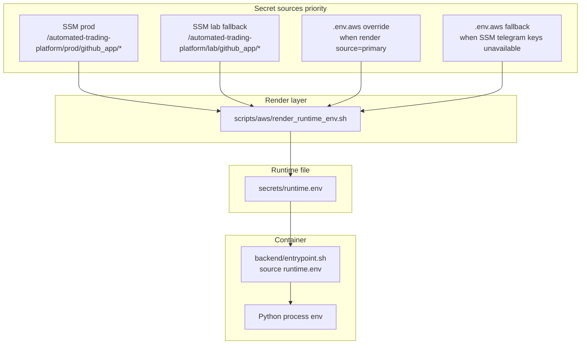
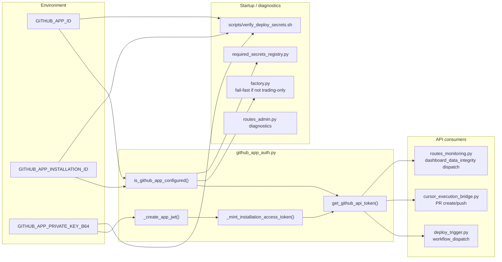
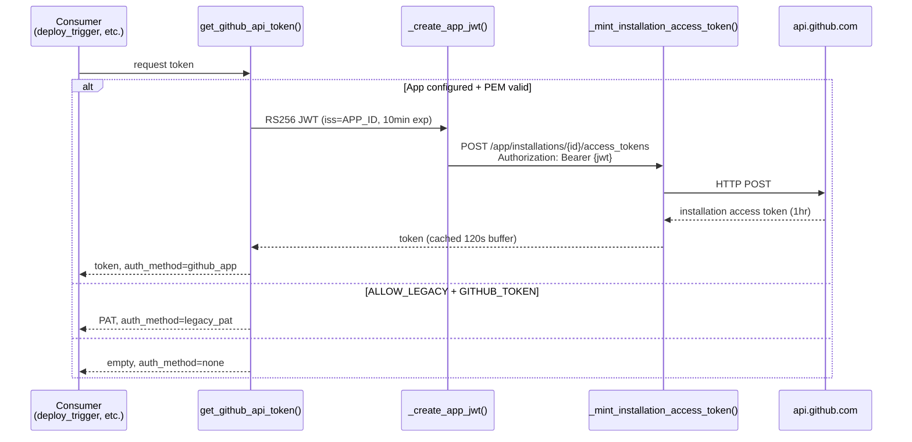
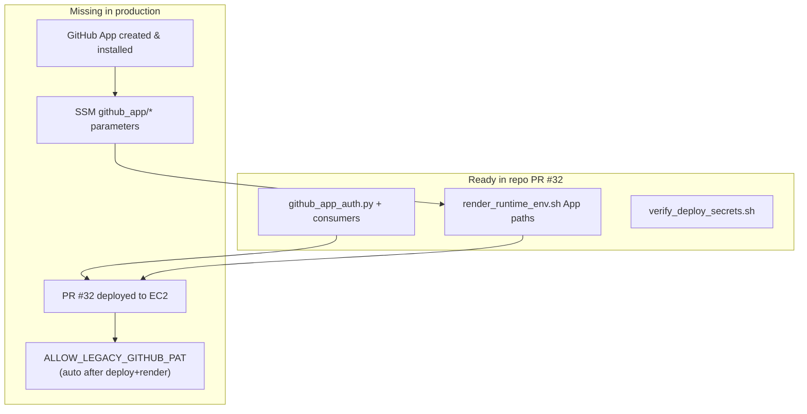

# GitHub App Runtime Dependency Graph

**Date:** 2026-06-09  
**Scope:** `GITHUB_APP_ID`, `GITHUB_APP_INSTALLATION_ID`, `GITHUB_APP_PRIVATE_KEY_B64` — expected locations, render path, consumption, and component dependencies.

---

## Variable reference

| Variable | Purpose |
|----------|---------|
| `GITHUB_APP_ID` | GitHub App numeric ID; JWT `iss` claim |
| `GITHUB_APP_INSTALLATION_ID` | Installation ID for `ccruz0/crypto-2.0` (or org) |
| `GITHUB_APP_PRIVATE_KEY_B64` | Base64-encoded PEM private key for RS256 JWT signing |

Related (not App credentials):

| Variable | Role |
|----------|------|
| `GITHUB_TOKEN` | Legacy PAT; used only when `ALLOW_LEGACY_GITHUB_PAT=true` |
| `ALLOW_LEGACY_GITHUB_PAT` | Escape hatch; auto-set by render script during transition |
| `GITHUB_REPOSITORY` | Target repo (`ccruz0/crypto-2.0` default) |
| `DEPLOY_WORKFLOW_FILE` | Default `deploy_session_manager.yml` |
| `GITHUB_WEBHOOK_SECRET` | Webhook signature (optional; separate from App auth) |

---

## Where values are expected



### SSM paths (production)

```
/automated-trading-platform/prod/github_app/app_id
/automated-trading-platform/prod/github_app/installation_id
/automated-trading-platform/prod/github_app/private_key_b64   # SecureString recommended
```

### SSM paths (LAB fallback when prod empty)

```
/automated-trading-platform/lab/github_app/app_id
/automated-trading-platform/lab/github_app/installation_id
/automated-trading-platform/lab/github_app/private_key_b64
```

### Template / documentation

| Location | Purpose |
|----------|---------|
| `secrets/runtime.env.example` | Commented placeholders |
| `backend/docs/GITHUB_APP_AUTH.md` | Operator runbook |
| `docs/runbooks/secrets_runtime_env.md` | SSM path reference |

**Production today:** All three SSM prod paths are **absent**. Render produces PAT-only `runtime.env` with `GITHUB_AUTH_MODE=legacy_transition` after PR #32 deploy.

---

## Where values are rendered

`scripts/aws/render_runtime_env.sh` logic:

1. If AWS CLI + STS identity OK → fetch SSM (prod, then lab fallback for each App key).
2. If primary telegram/admin keys found → `source=primary`; merge `.env.aws` overrides for App keys.
3. Else → `source=fallback`; read all keys from `.env.aws`.
4. Write non-empty keys to `secrets/runtime.env` (lines 185–188).
5. Post-merge auth mode (lines 254–279):
   - All three App keys → `GITHUB_AUTH_MODE=github_app`, strip `ALLOW_LEGACY_GITHUB_PAT`
   - PAT only → `GITHUB_AUTH_MODE=legacy_transition`, set `ALLOW_LEGACY_GITHUB_PAT=true`
   - Neither → `GITHUB_AUTH_MODE=none`

Invoked by:

| Invoker | When |
|---------|------|
| `.github/workflows/deploy_session_manager.yml` | Every prod deploy (SSM step, line 158) |
| `deploy_all.sh` | Manual deploy mirror |
| Operator manually | Troubleshooting |

**Not rendered by:** `deploy_session_manager.yml` PAT inject block (writes `GITHUB_TOKEN` directly, bypasses App logic).

---

## Where values are consumed



### Token minting flow (detail)



---

## Component dependency matrix

| Component | Depends on App vars? | Depends on PAT? | Active when ATP_TRADING_ONLY=1? |
|-----------|---------------------|-----------------|--------------------------------|
| `github_app_auth.py` | **Yes** (direct read) | Fallback only | Loaded on demand |
| `deploy_trigger.py` | Via `get_github_api_token()` | Legacy fallback | Code present; not startup-gated |
| `cursor_execution_bridge.py` | Via `get_github_api_token()` | Legacy fallback | Same |
| `routes_monitoring.py` (integrity workflow) | Via `get_github_api_token()` | Legacy fallback | Same |
| `factory.py` startup checks | Validates App or legacy | Legacy path needs flag | **Skipped** |
| `required_secrets_registry.py` | Reports missing App keys | Legacy path if flag set | Returns empty if trading-only |
| `entrypoint.sh` | Sources env file | Sources PAT if present | Always |
| `render_runtime_env.sh` | Fetches/writes App keys | Still fetches PAT | N/A (host script) |
| `verify_deploy_secrets.sh` | Checks all three | Checks legacy path | Runs if container up |
| `routes_github_webhook.py` | No | No | Uses `GITHUB_WEBHOOK_SECRET` |
| OpenClaw LAB stack | No | Separate `OPENCLAW_*` | N/A |

---

## GitHub App permissions required

Minimum for current consumers:

| Permission | Used by |
|------------|---------|
| **Actions: Read & write** | `workflow_dispatch` (deploy, dashboard integrity) |
| **Contents: Read & write** | Cursor bridge git push / PR |
| **Pull requests: Read & write** | Cursor bridge PR creation |
| **Metadata: Read** | Standard API access |

---

## Verification commands (no secret values)

```bash
# On EC2 after render
bash scripts/aws/render_runtime_env.sh
# Expect: GITHUB_APP=YES GITHUB_AUTH_MODE=github_app (after SSM populated)

./scripts/verify_deploy_secrets.sh
# Expect: auth_mode: github_app

docker compose --profile aws logs backend-aws --tail=80 | grep -i "GitHub auth"
# Expect: github_auth=present app=yes
```

---

## Production gap diagram



**Conclusion:** Code and render infrastructure are **ready**; production is blocked on **GitHub App creation**, **SSM population**, and **deploy of PR #32**.
