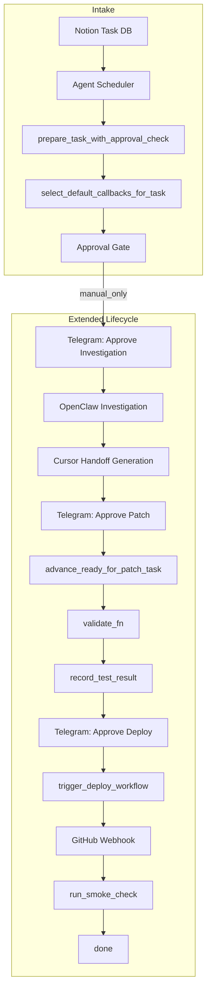
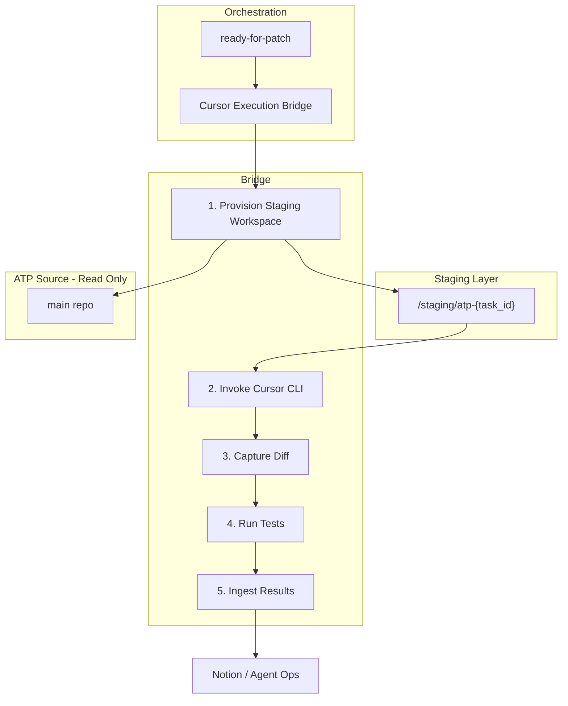

# Cursor Execution Bridge — Architecture Proposal

> **Goal:** Define the architecture and first implementation plan for a controlled Cursor execution layer that can apply patches automatically in a writable staging workspace, capture diffs, run tests, and feed results back into the orchestration lifecycle—while preserving ATP as the read-only source of truth.

---

## 1. Current System Review

### 1.1 Orchestration Flow (End-to-End)



### 1.2 Component Summary

| Component | Role | Current State |
|-----------|------|---------------|
| **OpenClaw investigation** | AI investigation, writes docs to `docs/agents/bug-investigations/` | Working; produces structured sections (Root Cause, Affected Files, Recommended Fix, Testing Plan) |
| **Cursor handoff generation** | Builds Cursor-ready prompt from OpenClaw sections | Working; saves to `docs/agents/cursor-handoffs/cursor-handoff-{task_id}.md` |
| **Telegram approvals** | Human gates: investigation, patch, deploy | Working; `agent_telegram_approval` |
| **Test gate** | `record_test_result` writes `test_status` to Notion | Working; validation callbacks feed it |
| **Deploy trigger** | `workflow_dispatch` to GitHub Actions | Working; deploys `main` via SSM |
| **Webhook** | `workflow_run` completion → smoke check | Working; `routes_github_webhook.py` |
| **Smoke check** | Health probes, `record_smoke_check_result` | Working; `deploy_smoke_check.py` |

### 1.3 The Gap (Addressed by Cursor Execution Bridge)

| Missing Piece | Description | Status |
|---------------|-------------|--------|
| **Writable staging workspace** | ATP is the source of truth; backend runs in Docker with `workspace_root()` pointing at `/app` or local repo. No isolated writable copy for patch application. | ✅ Addressed: `provision_staging_workspace` clones to `$ATP_STAGING_ROOT/atp-{task_id}` |
| **Automatic patch application** | Cursor handoff is a **markdown file**; a human must open Cursor, paste the prompt, and apply changes manually. No programmatic execution. | ✅ Addressed: `invoke_cursor_cli` runs Cursor in non-interactive mode |
| **Diff capture** | No structured capture of what changed before/after patch application. | ✅ Addressed: `capture_diff` writes to `docs/agents/patches/{task_id}.diff` |
| **Real test execution** | `validate_fn` for bug/code tasks often checks artifact existence (e.g. investigation note, patch note) rather than running `pytest` or `npm run build`. | ✅ Addressed: `run_tests_in_staging` runs pytest + npm lint/build |
| **Result ingestion** | `record_test_result` exists but is fed by format/artifact validation, not by actual test run outcomes. | ✅ Addressed: `ingest_bridge_results` feeds real test outcomes |

---

## 2. Proposed Architecture

### 2.1 Principles

1. **ATP source of truth is read-only** — The main repo (`automated-trading-platform`) is never modified by the bridge. All edits happen in an ephemeral staging workspace.
2. **Staging is isolated** — Each task gets a dedicated staging directory. No cross-task contamination.
3. **Deploy only from main** — The deploy workflow pulls `main`. Patches must be merged via PR; the bridge does not push to `main` directly.
4. **Approval gates preserved** — Investigation, patch, and deploy approvals remain human-gated. The bridge automates only the mechanical steps between approvals.

### 2.2 High-Level Flow



### 2.3 Component List

| Component | Responsibility |
|-----------|----------------|
| **Staging Workspace Manager** | Clone or `git worktree` ATP into `$ATP_STAGING_ROOT/atp-{task_id}`; clean up after use. |
| **Cursor CLI Invoker** | Run `cursor agent -p --output-format json "<handoff_prompt>"` in staging dir. |
| **Diff Capturer** | Run `git diff` before/after; store in `docs/agents/patches/{task_id}.diff` or Notion metadata. |
| **Test Runner** | Execute `pytest`, `npm run lint`, `npm run build` in staging; capture exit code and output. |
| **Result Ingester** | Call `record_test_result`, `update_notion_task_metadata` with test outcome, diff reference, summary. |

---

## 3. Execution Flow (Detailed)

### 3.1 Trigger

- **Entry point:** `advance_ready_for_patch_task` (or a new `execute_cursor_patch_task`) when task is `ready-for-patch` and Cursor handoff exists.
- **Preconditions:**
  - Task has `_cursor_handoff_prompt` or file at `docs/agents/cursor-handoffs/cursor-handoff-{task_id}.md`
  - Staging root is configured (`ATP_STAGING_ROOT`)
  - Cursor CLI is available (`cursor` or `npx cursor` in PATH)

### 3.2 Steps

| Step | Action | Output |
|------|--------|--------|
| 1 | Provision staging: `git clone` or `git worktree add` into `$ATP_STAGING_ROOT/atp-{task_id}` | Path to staging dir |
| 2 | Copy handoff prompt into staging (or pass via stdin) | — |
| 3 | Run `cursor agent -p --output-format json "<prompt>"` in staging dir | JSON response, exit code |
| 4 | Capture diff: `git diff --no-color > patch.diff` | Diff file |
| 5 | Run tests: `cd backend && pytest -q`; `cd frontend && npm run lint && npm run build` | Exit codes, stdout/stderr |
| 6 | Ingest: `record_test_result(task_id, outcome, summary)`; append diff path to Notion | — |
| 7 | Cleanup: remove staging dir (or retain for N hours for audit) | — |

### 3.3 Failure Handling

| Failure | Behavior |
|---------|----------|
| Staging provision fails | Log, Telegram alert, task stays `ready-for-patch` |
| Cursor CLI not found | Log, skip bridge; fall back to manual handoff |
| Cursor returns non-zero | Treat as apply failure; do not run tests; record `tests_not_run` |
| Tests fail | `record_test_result(outcome="failed", ...)`; task stays `patching` |
| Tests pass | `record_test_result(outcome="passed", ...)`; task advances to `awaiting-deploy-approval` |

---

## 4. Safety Controls

### 4.1 Isolation

| Control | Implementation |
|---------|----------------|
| **Read-only ATP** | Bridge never writes to `workspace_root()`. All writes go to staging. |
| **Ephemeral staging** | Staging dirs are under `$ATP_STAGING_ROOT`; cleaned after use or after TTL (e.g. 24h). |
| **No direct push to main** | Bridge does not `git push`. Optional: create PR from staging branch for human review. |

### 4.2 Approval Gates (Unchanged)

- Investigation approval → required before OpenClaw runs.
- Patch approval → required before bridge provisions staging and invokes Cursor.
- Deploy approval → required before `trigger_deploy_workflow`.

### 4.3 Scope Limits

| Limit | Value | Purpose |
|-------|-------|---------|
| Max staging dirs | 5 (configurable) | Prevent disk exhaustion |
| Staging TTL | 24h | Auto-cleanup |
| Cursor timeout | 300s (configurable) | Avoid hung runs |
| Test timeout | 120s per suite | Fail fast |

### 4.4 Audit

- All bridge invocations logged to `agent_activity.jsonl` with `event_type: cursor_bridge_*`.
- Diff files stored for traceability.
- Agent Ops UI can surface bridge runs (success/failure, task_id, duration).

---

## 5. First Implementation Phase (Minimal Risk)

### 5.1 Phase 1: Staging + Cursor Invocation (No Deploy Path)

**Scope:** Prove that we can provision staging and run Cursor CLI non-interactively. No test execution, no result ingestion yet.

**Deliverables:**

1. **`backend/app/services/cursor_execution_bridge.py`**
   - `provision_staging_workspace(task_id: str) -> Path | None`
   - `invoke_cursor_cli(staging_path: Path, prompt: str) -> dict`
   - `cleanup_staging(task_id: str) -> None`

2. **Configuration**
   - `ATP_STAGING_ROOT` — default `/tmp/atp-staging` (or `$HOME/.atp-staging`)
   - `CURSOR_CLI_PATH` — default `cursor` (or `npx cursor`)

3. **Integration point**
   - New callback or branch in `advance_ready_for_patch_task`: when `apply_change_fn` is "cursor handoff" (no OpenClaw apply), call bridge instead.
   - Or: new API endpoint `POST /api/agent/cursor-bridge/run` for manual trigger with task_id.

**Success criteria:**
- Staging dir created with ATP clone.
- Cursor CLI runs and produces output (even if patch is trivial).
- No changes to main repo.
- Logs in `agent_activity.jsonl`.

### 5.2 Phase 2: Diff Capture + Test Execution

**Scope:** After Cursor runs, capture diff and run pytest + frontend checks.

**Deliverables:**

1. **`capture_diff(staging_path: Path, task_id: str) -> Path | None`**
   - Writes `docs/agents/patches/{task_id}.diff`
   - Returns path for metadata

2. **`run_tests_in_staging(staging_path: Path) -> dict`**
   - Returns `{backend_ok, frontend_ok, backend_output, frontend_output}`

3. **Integration**
   - Bridge step 4–5 in execution flow

### 5.3 Phase 3: Result Ingestion

**Scope:** Feed test outcome and diff path back to Notion and test gate.

**Deliverables:**

1. **`ingest_bridge_results(task_id, test_result, diff_path, summary)`**
   - Calls `record_test_result`
   - Updates Notion metadata: `patch_diff_path`, `cursor_bridge_outcome`
   - Appends comment with summary

2. **Agent Ops UI**
   - Show `cursor_bridge_*` events in recovery/failed-investigations views

### 5.4 Phase 4 (Optional): PR Creation

**Scope:** Create a PR from staging branch so human can review and merge. Not auto-merge.

**Deliverables:**
- `create_patch_pr(staging_path, task_id, handoff_title) -> str | None` (PR URL)
- Telegram message with PR link instead of "apply in Cursor manually"

---

## 6. Environment Variables

| Variable | Default | Purpose |
|----------|---------|---------|
| `CURSOR_BRIDGE_ENABLED` | `false` | Master switch; must be `true` to run bridge |
| `ATP_STAGING_ROOT` | `/tmp/atp-staging` | Root directory for staging workspaces |
| `CURSOR_CLI_PATH` | `cursor` | Path to Cursor CLI binary |
| `CURSOR_CLI_TIMEOUT` | `300` | Timeout in seconds for Cursor invocation |
| `CURSOR_BRIDGE_TEST_TIMEOUT` | `120` | Timeout per test suite (backend/frontend) |
| `CURSOR_BRIDGE_AUTO_IN_ADVANCE` | `false` | When true, `advance_ready_for_patch_task` runs bridge automatically when handoff exists |

---

## 7. File Layout (Proposed)

```
backend/app/services/
  cursor_execution_bridge.py   # New: staging, invoke, diff, test, ingest
  cursor_handoff.py            # Existing: prompt generation
  agent_task_executor.py       # Existing: integrate bridge in advance_ready_for_patch_task
  agent_callbacks.py           # Existing: optional new callback pack "cursor_bridge"

docs/agents/
  cursor-handoffs/             # Existing: handoff prompts
  patches/                     # New: {task_id}.diff
  cursor-bridge/               # New: README, runbook for bridge

.env / secrets/
  ATP_STAGING_ROOT             # Optional: staging root
  CURSOR_CLI_PATH              # Optional: cursor binary path
  CURSOR_BRIDGE_ENABLED        # Optional: master switch (default false)
```

---

## 8. Cursor CLI Non-Interactive Mode

From [Cursor CLI docs](https://cursor.com/docs/cli/using):

- `-p` / `--print`: Non-interactive mode; prints response to console.
- `--output-format json`: Structured output for parsing.
- **"Cursor has full write access in non-interactive mode"** — suitable for patch application.

**Example invocation:**

```bash
cd /tmp/atp-staging/atp-abc123
cursor agent -p --output-format json "$(cat /app/docs/agents/cursor-handoffs/cursor-handoff-abc123.md)"
```

Or via stdin:

```bash
cursor agent -p --output-format json < /app/docs/agents/cursor-handoffs/cursor-handoff-abc123.md
```

---

## 9. Summary

| Item | Recommendation |
|------|----------------|
| **Architecture** | Staging workspace + Cursor CLI invoker + diff capture + test runner + result ingester. ATP remains read-only. |
| **First phase** | Staging provision + Cursor invocation only; no test/ingest. Manual trigger via API or scheduler branch. |
| **Safety** | Ephemeral staging, approval gates unchanged, no direct push to main, audit logging. |
| **Risk** | Low for Phase 1: no production code paths changed; bridge is additive and gated by `CURSOR_BRIDGE_ENABLED`. |

---

## 10. Implementation Status

| Phase | Status | Location |
|-------|--------|----------|
| Phase 1: Staging + Cursor invocation | ✅ Done | `cursor_execution_bridge.py`, `POST /api/agent/cursor-bridge/run` |
| Phase 2: Diff capture + test execution | ✅ Done | `capture_diff`, `run_tests_in_staging`, `run_bridge_phase2` |
| Phase 3: Result ingestion | ✅ Done | `ingest_bridge_results`, `record_test_result`, Notion metadata |
| Phase 4: PR creation | ✅ Done | `create_patch_pr`, `create_pr` parameter |
| Scheduler integration | ✅ Done | `CURSOR_BRIDGE_AUTO_IN_ADVANCE` in `advance_ready_for_patch_task` |
| Telegram button | ✅ Done | "Run Cursor Bridge" after patch approval |

---

## 11. Troubleshooting

| Symptom | Cause | Fix |
|---------|-------|-----|
| Bridge not running | `CURSOR_BRIDGE_ENABLED` not set | Set to `true` in env |
| "handoff file not found" | No `cursor-handoff-{task_id}.md` | Ensure OpenClaw investigation completed; handoff generated after patch approval |
| "Cursor CLI not found" | `cursor` not in PATH | Install Cursor CLI or set `CURSOR_CLI_PATH` |
| "git clone failed" | Staging root not writable | Set `ATP_STAGING_ROOT` to a writable path |
| "git push failed" | `GITHUB_TOKEN` missing or no `repo` scope | Add token with `repo` scope for PR creation |
| "max staging dirs reached" | Too many concurrent tasks | Run `cleanup_staging(task_id)` or remove `$ATP_STAGING_ROOT/atp-*` |
| Tests fail in staging | pytest/npm not in staging clone | Ensure backend/frontend have `requirements.txt` / `package.json` |
| Scheduler doesn't run bridge | `CURSOR_BRIDGE_AUTO_IN_ADVANCE` not set | Set to `true` for automatic invocation |
