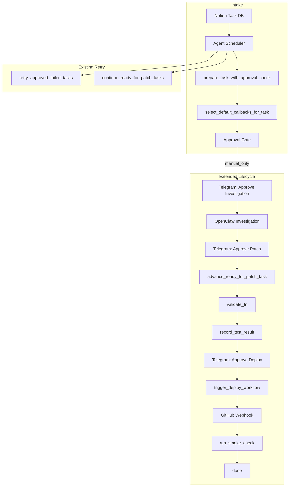

# OpenClaw Autonomous Recovery Layer — Design

> **Goal:** Allow OpenClaw to automatically diagnose and recover from known low-risk orchestration failures without human intervention, while preserving approval gates for higher-risk actions.

---

## 1. Current Orchestration Architecture



| Component | Role | Failure Modes Observed |
|-----------|------|------------------------|
| **Notion** | Task DB, status, metadata (Test Status, final_result) | Schema missing fields (400), metadata write fails |
| **Telegram** | Approval requests, deploy/smoke buttons | Rate limits, message delivery |
| **OpenClaw** | AI investigation, content quality gate | Empty/fallback responses, timeout |
| **Cursor handoff** | Sections sidecar, docs/ artifacts | Path resolution (/docs), volume mounts |
| **Deploy trigger** | workflow_dispatch to GitHub | GITHUB_TOKEN missing |
| **Webhook** | workflow_run completion → smoke check | Correlation miss (no deploying task), wrong workflow |
| **Smoke check** | Health probes, advance to done | ATP_HEALTH_BASE wrong, timeout |

---

## 2. Observed Low-Risk Failure Modes

| Failure | Root Cause | Risk | Human Effort Today |
|---------|------------|------|--------------------|
| **Stuck in patching** | Scheduler only queried `ready-for-patch`; task already in `patching` | Low | Manual status reset or wait |
| **Test Status not persisted** | Notion schema lacks property; metadata write 400 | Low | Add property in Notion, retry |
| **Investigation file missing** | Container restart; docs/ not volume-mounted | Low | Re-run from `planned` |
| **OpenClaw empty/fallback** | API timeout, misconfig, quality gate | Low | Retry (now 1 retry built-in) |
| **Webhook correlation miss** | No deploying task; deploy tracker empty | Medium | Manual smoke check button |
| **Deploy gate blocked** | Test Status empty but task in awaiting-deploy | Low | Fix schema, re-validate |
| **Approved task never executed** | Execution failed; retry_count under limit | Low | retry_approved_failed_tasks picks up |

---

## 3. Recovery Policy Engine — Design

### 3.1 Principles

1. **Bounded auto-actions** — Each playbook has a fixed retry limit and clear trigger.
2. **Safety classification** — `low` (read-only or idempotent), `medium` (status/metadata), `high` (deploy, trading).
3. **Approval preserved** — Deploy, patch approval, investigation approval remain human-gated.
4. **Escalation** — After retry limit, log + Telegram alert; no silent failure.

### 3.2 Engine Location

- **Module:** `backend/app/services/agent_recovery.py`
- **Invocation:** Called from `agent_scheduler` at the end of each cycle (after `continue_ready_for_patch_tasks`).
- **Scope:** One recovery cycle per scheduler interval; processes at most N tasks per cycle.

### 3.3 Policy Structure

```python
# Pseudocode
RecoveryPlaybook = {
    "id": str,
    "trigger_condition": Callable[[Context], bool],
    "action": Callable[[Context], Result],
    "retry_limit": int,
    "safety": "low" | "medium" | "high",
    "approval_required": bool,
    "escalation": "telegram" | "notion_comment" | "both",
}
```

---

## 4. Auto-Actions (Proposed)

### 4.1 Re-validate Stuck Patching Tasks

| Field | Value |
|-------|-------|
| **Trigger** | Task in `patching` for > 15 min, validation last attempted > 10 min ago |
| **Action** | Call `advance_ready_for_patch_task(task_id)` (idempotent) |
| **Retry limit** | 3 attempts per task per 24h |
| **Safety** | Low (re-runs validation only; no deploy) |
| **Approval** | No |
| **Escalation** | If still stuck after 3: Telegram + Notion comment |

**Rationale:** Scheduler already picks up `patching`; this handles transient validation failures (e.g. file not yet visible, Notion eventual consistency).

---

### 4.2 Retry Test Status Write (Schema-Recovery)

| Field | Value |
|-------|-------|
| **Trigger** | Task in `patching`, validation passed, `record_test_result` returned `metadata_ok=False` (schema_missing_fields includes `test_status`) |
| **Action** | Re-call `update_notion_task_metadata` for `test_status` only; if schema was fixed externally, write may succeed |
| **Retry limit** | 2 attempts per task |
| **Safety** | Low (metadata write only) |
| **Approval** | No |
| **Escalation** | Notion comment: "Test Status still not writable — add property in Notion DB" |

**Rationale:** Operator may add the missing property; recovery can retry without re-running validation.

---

### 4.3 Smoke Check for Orphaned Deploying Tasks

| Field | Value |
|-------|-------|
| **Trigger** | Task in `deploying` for > 10 min, no webhook smoke check recorded in last 10 min |
| **Action** | Call `run_and_record_smoke_check(task_id, advance_on_pass=True)` |
| **Retry limit** | 1 per task (one auto smoke check) |
| **Safety** | Medium (advances to done or blocked) |
| **Approval** | No (smoke check is read-only health probe + status update) |
| **Escalation** | If smoke fails: existing `record_smoke_check_result` blocks task; Telegram already notified by smoke module |

**Rationale:** Webhook correlation can miss (e.g. multiple deploys, tracker eviction). A single delayed smoke check is a safe fallback.

---

### 4.4 Reset Investigation for Missing Artifacts

| Field | Value |
|-------|-------|
| **Trigger** | Task in `investigation-complete` or `ready-for-patch`, investigation file missing at expected path |
| **Action** | Move task back to `planned`; clear `AgentApprovalState` for that task; append Notion comment |
| **Retry limit** | 1 per task |
| **Safety** | Medium (status rollback) |
| **Approval** | No (recovery from bad state) |
| **Escalation** | Notion comment: "Investigation file missing; task reset to planned for re-investigation" |

**Rationale:** After container restart without volume mount, artifacts are gone. Reset allows a clean re-run.

---

### 4.5 OpenClaw Re-investigation (Already Partially Implemented)

| Field | Value |
|-------|-------|
| **Trigger** | `_apply_via_openclaw` failed (after 1 retry); task still in `in-progress` |
| **Action** | Already handled: no fallback, task stays put; Telegram notified by executor |
| **Retry limit** | 1 (in `_apply_via_openclaw`) |
| **Safety** | Low |
| **Approval** | Yes (investigation requires new approval) |
| **Escalation** | Telegram notification already sent |

**Rationale:** No additional auto-action; current behavior is correct. Optional: add "Reset to planned" button in Telegram for operator-initiated retry.

---

## 5. First 3 Playbooks to Implement

Recommended order:

| # | Playbook | Effort | Impact |
|---|----------|--------|--------|
| 1 | **Smoke Check for Orphaned Deploying** | Low | High — unblocks tasks when webhook misses |
| 2 | **Re-validate Stuck Patching** | Low | Medium — handles transient validation failures |
| 3 | **Reset Investigation for Missing Artifacts** | Medium | Medium — recovers from container/volume issues |

---

## 6. Implementation Sketch

### 6.1 New Module: `agent_recovery.py`

```python
# backend/app/services/agent_recovery.py

def run_recovery_cycle(*, max_actions: int = 5) -> list[dict[str, Any]]:
    """Run one recovery cycle. Returns list of actions taken."""
    results = []
    # 1. Find tasks in deploying > 10 min, no recent smoke check
    # 2. For each: run_and_record_smoke_check (once per task per day)
    # 3. Find tasks in patching > 15 min
    # 4. For each: advance_ready_for_patch_task (idempotent)
    # 5. Find tasks with missing investigation file
    # 6. For each: reset to planned (once per task)
    return results
```

### 6.2 Scheduler Integration

```python
# In agent_scheduler.py, after continue_ready_for_patch_tasks:
try:
    recovery_results = await loop.run_in_executor(None, run_recovery_cycle)
    if recovery_results:
        logger.info("recovery_cycle_done count=%d", len(recovery_results))
except Exception as e:
    logger.error("agent_scheduler_loop: recovery_cycle raised %s", e, exc_info=True)
```

### 6.3 Configuration

| Env Var | Default | Purpose |
|---------|---------|---------|
| `AGENT_RECOVERY_ENABLED` | `true` | Master switch for recovery |
| `AGENT_RECOVERY_MAX_ACTIONS` | `5` | Max actions per cycle |
| `AGENT_RECOVERY_DEPLOYING_STALE_MIN` | `10` | Min minutes before orphan smoke check |
| `AGENT_RECOVERY_PATCHING_STALE_MIN` | `15` | Min minutes before re-validate |

---

## 7. Safety Matrix

| Action | Modifies Notion | Modifies DB | Triggers Deploy | Requires Approval |
|--------|-----------------|-------------|-----------------|-------------------|
| Re-validate patching | No (status read) | No | No | No |
| Retry Test Status write | Yes (metadata) | No | No | No |
| Orphan smoke check | Yes (status, comment) | No | No | No |
| Reset to planned | Yes (status) | Yes (clear approval) | No | No |

---

## 8. Escalation Paths

| Playbook | After Retry Limit | Escalation |
|----------|-------------------|------------|
| Re-validate patching | Task still stuck | Telegram: "Task X stuck in patching after 3 auto-retries" |
| Retry Test Status | Still not writable | Notion comment only |
| Orphan smoke check | N/A (1 attempt) | Smoke failure → existing blocked + Telegram |
| Reset investigation | N/A (1 attempt) | Notion comment only |

---

## 9. Out of Scope (Explicitly Not Auto-Recovered)

- **Deploy trigger** — Always requires Telegram approval.
- **Patch approval** — Always requires Telegram approval.
- **Investigation approval** — Always requires Telegram approval.
- **Trading / exchange / order operations** — Never touched by recovery.
- **Notion schema changes** — Operator must add properties manually.
- **GitHub webhook configuration** — Operator must fix URL/secret.

---

## 10. Success Criteria

- Tasks no longer stuck in `patching` due to transient validation failures.
- Tasks in `deploying` receive smoke check even when webhook correlation misses.
- Tasks with missing investigation artifacts can be reset for clean re-run.
- No new approval gates bypassed.
- All recovery actions logged to `agent_activity.jsonl` for audit.
