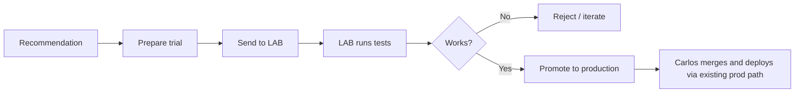

# Jarvis Operator UX + LAB → Promote Flow

> **Status:** Agreed design (Carlos, 2026-08-08) — Phases A (#404) + B (#405) shipped;
> Phase C (Promote = open PR after LAB green) implemented in code — enable on host via
> `JARVIS_PROMOTE_PR_ENABLED=true` (default false; does not flip broad Gate-2 write flags).  
> **Audience:** Carlos (non-engineer operator) + implementers building Phases A/B/C  
> **Related:** `JARVIS_CONTROL_CENTER_IMPLEMENTATION_PLAN.md`, `docs/runbooks/jarvis-phase5-safety-flag-verification.md`, `docs/runbooks/LAB_JARVIS_BUILDER_BOOTSTRAP.md`, CLAUDE.md ACW safety flags

---

## 0. Locked decisions

These are **closed**. Do not re-open in implementation PRs unless Carlos explicitly changes them.

| # | Decision | Locked as |
|---|----------|-----------|
| 1 | Primary operator journey | **Recommendation → Send to LAB → Promote to production** |
| 2 | What “Approve” means | **Send to LAB** (allow a LAB trial) — **not** investigate-only, **not** direct prod |
| 3 | First deliverable | Design doc (this file). Implementation follows in phased PRs. |
| 4 | What **Promote** means | **Open PR + Carlos merges/deploys** via the existing prod path. **Not** auto-deploy, auto-merge, or silent prod write. |
| 5 | Improvement tab | Keep as a **Suggestions** feed that drops into the **same trial queue** (not a second Execute world). |
| 6 | Phase-5 jargon | Sandbox / Gate 1–2 / PR Approve copy stays behind **Advanced** (or only when flags are on). |
| 7 | LAB green gate | Tests green **unlocks** Promote; **Carlos still clicks Promote**. |
| 8 | Safety defaults | Stay conservative: `patch_apply`, `pr_creation`, `github_write` default **false**; `double_approval` default **true**. No autonomous prod writes. |

### Remaining open (minimal)

| Item | Suggestion | Owner |
|------|------------|-------|
| Soft-redirect `/jarvis/approval` → Ops Jarvis (Advanced) now vs keep as power deep-link during A | Soft-redirect in Phase A; keep URL as Advanced deep-link until deprecate | Implement Phase A |

Everything else in §0 is locked.

---

## 1. Current pain

Carlos faces **multiple Jarvis “action” surfaces that mean different things**, all labeled like execution:

| What he sees | Where | What it actually does |
|---|---|---|
| **Execute** | Ops → Jarvis Improvement | Queues a **dry-run investigation** — does not apply or deploy |
| **Approve / Reject** | Ops → Jarvis | Approves continuing a **dry-run plan** |
| **Approve sandbox apply / Approve PR creation** | `/jarvis/approval` | Phase-5 Gate 1/2 (usually **flags off**) |
| **Run Investigation / Generate Patch Proposal** | Ops → Production Diagnostics | Read-only dig + proposal only |
| Links that say “Ops → Jarvis **or** Approval Center” | Improvement copy | **Misleading** — Execute deep-links only to Ops Jarvis |

**Net:** two different Approve worlds, engineer jargon (Phase 3/4/4B/5, Gate 1–2, dry-run, sandbox), and **no UI path that matches** Recommendation → LAB trial → decide → new prod version.

---

## 2. Target operator journey

Plain language (what Carlos should see):

1. Jarvis suggests something concrete enough to try.
2. He taps **Send to LAB** (that’s “Approve” for a trial — not investigate-only, not prod).
3. LAB applies + tests in isolation.
4. He reviews LAB result (pass/fail in human words).
5. When tests are green, **Promote to production** becomes available; he still clicks it.
6. Promote **opens a PR**; Carlos merges and deploys through the existing human-gated prod path. Never automatic.

Safety stays: no autonomous prod writes; promote is a **separate human gate** after LAB green.

---

## 3. Inventory (today)

### Navigation (Ops ▾)

| Label | Route | File |
|---|---|---|
| Jarvis | `/?tab=jarvis` | `frontend/src/app/components/tabs/JarvisControlTab.tsx` |
| Alerts | `/?tab=jarvis-alerts` | `JarvisAlertsTab.tsx` |
| Daily Reports | `/?tab=jarvis-daily-reports` | `JarvisDailyReportsTab.tsx` |
| Jarvis Analytics | `/?tab=jarvis-analytics` | `JarvisAnalyticsTab.tsx` |
| Jarvis Improvement | `/?tab=jarvis-improvement` | `JarvisImprovementTab.tsx` |
| Production Diagnostics | `/?tab=production-diagnostics` | `ProductionDiagnosticsTab.tsx` + `ProposalEligibilityPanel.tsx` |
| Scheduled Investigations | `/?tab=scheduled-investigations` | `ScheduledInvestigationsTab.tsx` |
| **Jarvis Approval Center** | `/jarvis/approval` | `frontend/src/app/jarvis/approval/page.tsx` |

Nav wiring: `DashboardTabNav.tsx`, tab ids in `utils/dashboardTabs.ts`.

### Write buttons that matter

| Label | Surface | API | Real effect |
|---|---|---|---|
| Submit to Jarvis | Ops Jarvis | `POST /jarvis/tasks/submit` | Dry-run task |
| Approve / Reject | Ops Jarvis | `…/tasks/{id}/approve\|reject` | Continue/stop dry-run plan |
| Execute | Improvement | `POST …/improvement/recommendations/execute` | Queue dry-run + manual approval |
| Open Jarvis to Approve | Improvement (post-execute) | nav to `/?tab=jarvis&task=` | Jump to Ops Approve |
| Run Investigation | Diagnostics | `POST …/investigations/run` | Read-only |
| Generate Patch Proposal | Diagnostics | `POST …/investigations/{id}/propose-patch` | Proposal only (4B flag) |
| Approve sandbox apply | Approval Center | `…/change/{id}/approve-apply` | Gate 1 — **gated off** by default |
| Approve PR creation | Approval Center | `…/change/{id}/approve-pr` | Gate 2 — **gated off** by default |
| Reject task | Approval Center | `…/change/{id}/reject` | Reject change task |

**Not present for Jarvis code flow:** Send to LAB · LAB result review · Promote to production.  
(Unrelated “Promote” exists for **ML strategy models** — keep that name out of Jarvis UX, or always say **Promote to production** on Jarvis surfaces.)

---

## 4. Backend vs gaps (promote loop)

| Capability | Status |
|---|---|
| Dry-run investigate | **Works** (`JARVIS_DRY_RUN_ONLY` default true) |
| Improvement → queue recommendation | **Works** (dry-run only) |
| Patch proposal (4B templates) | **Works when flag on**; no deploy |
| Phase 4 change pipeline | **Stub patches** (TODO diffs) |
| Sandbox apply / PR create | **Implemented, flags default off**; never merge/deploy |
| Real Cursor ACW / coding_workflow | **Missing from tree** (docs stale) |
| Builder prepare (Control Center) | **Stub** |
| Send to LAB / LAB test orchestration | **Phase B shipped (#405)** — isolated sandbox; remote LAB host = B2 |
| Promote to prod (Jarvis) | **Phase C shipped** — open PR after LAB green via `JARVIS_PROMOTE_PR_ENABLED`; merge/deploy still human |

Safety flags that stay conservative (CLAUDE.md): `patch_apply_enabled`, `pr_creation_enabled`, `github_write_enabled` default **false**; `double_approval_required` default **true**.

---

## 5. Proposed UX information architecture

### One primary home: **Ops → Jarvis** (mental model: “Jarvis Trials”)

Single queue of **recommendations / trials**, each with a clear stage:

`Suggested → Ready for LAB → Testing in LAB → LAB result → Ready to promote → Done / Rejected`

Secondary (keep, but not the “act” path):

- **Alerts / Daily Reports** — stay as ops reading
- **Diagnostics** — “Ask Jarvis to investigate” (power path; no second Approve → prod)
- **Analytics / Improvement** — Improvement stays as **Suggestions** feed that drops into the same trial queue
- **Advanced** (collapsed) — Phase-5 sandbox/PR, safety flags, raw JSON, costs

### Where Approval Center goes

**Consolidate into Ops → Jarvis** as the trial detail panel / “Waiting on you” section.

- Default operators never visit `/jarvis/approval`.
- Route can remain as deep-link/Advanced redirect during transition, then deprecate (see open item in §0).
- Copy that points Improve → Approval Center for dry-run tasks should be removed (wrong destination).

### Non-engineer vs Advanced

| Carlos always sees | Advanced / power only |
|---|---|
| Recommendation in plain English | Phase labels, Gate 1/2, flag toggles |
| **Send to LAB** / **Reject** | Approve sandbox apply / Approve PR creation |
| LAB pass/fail + short why | Diff hunks, risk_score, pytest logs dump |
| **Promote to production** (only when LAB green) | GitHub write status, cost USD, Plan JSON |
| Progress: Suggested → LAB → Promote | Multi-agent pipeline cards |

---

## 6. Button taxonomy (before → after)

| Before | After (operator) | Meaning |
|---|---|---|
| Execute (Improvement) | **Prepare trial** or go straight to **Send to LAB** | Start a tryable package (investigate + patch artifact); Suggestions feed feeds the same queue |
| Approve (Ops Jarvis, dry-run) | **Send to LAB** | Allow isolated trial — *not* prod, *not* investigate-only |
| Reject (anywhere) | **Reject** | Stop this trial |
| Approve sandbox apply | Hide → Advanced: **Apply in sandbox** | Power/engineer; eventually = LAB apply under the hood |
| Approve PR creation | Hide → Advanced; primary path folds into **Promote** prep | Not a primary Carlos button |
| Open Jarvis to Approve | **Review trial** | One destination |
| *(missing)* | **Promote to production** | Final human gate after LAB green → **open PR**; Carlos merges/deploys |
| *(missing)* | Status chips: Testing in LAB / LAB passed / Needs changes | Replaces phase jargon |

**Rule:** never use bare **Approve** without an object. Prefer **Send to LAB** and **Promote to production**.

---

## 7. Phased delivery (PR-sized)

Small PRs only. One objective per PR. Investigation → recommendation before each write batch.

### Phase A — UX copy / consolidation (small, no new write power)

- Unify labels; fix Improvement → Approval Center misdirection.
- Keep Improvement as Suggestions feed into the same trial queue.
- One primary CTA path in Ops Jarvis; hide Phase-5 buttons behind Advanced (or “flags on” only).
- Single “Waiting on you” list (execution + change queues labeled as trials).
- Soft-redirect `/jarvis/approval` if agreed in that PR.
- **Risk:** low. Copy/nav only; brief muscle-memory confusion.
- **Rollback:** revert frontend copy/structure.
- **Validation:** click through Ops Jarvis + Improvement; no bare “Approve”; no Approval Center misdirection for dry-run tasks.

### Phase B — Real patch path into LAB

- Make **Send to LAB** package a **real artifact** (not stub TODO diff): wire proposal/patch → LAB apply/test (reuse sandbox/test runner + LAB host patterns from runbooks).
- Operator sees LAB status + pass/fail summary.
- Safety: LAB-only; prod flags stay off.
- **Risks:** stub patch agent; missing ACW package; LAB infra availability; conflating local sandbox with LAB.
- **Rollback:** disable Send-to-LAB feature flag; leave dry-run investigate.
- **Validation:** LAB trial applies + tests; UI shows pass/fail; no prod write observed.

### Phase C — Promote-to-prod gate

- Enable **Promote to production** only when LAB tests green **and** human clicks.
- Promote = **open PR** (or kick an approved “open PR” path) + clear copy that Carlos merges/deploys — **never** silent merge/deploy.
- Keep double-approval / github_write conservative; explicit enablement per gate.
- **Shipped:** gated by dedicated `JARVIS_PROMOTE_PR_ENABLED` (default false) so broad
  `JARVIS_PR_CREATION_ENABLED` / `JARVIS_GITHUB_WRITE_ENABLED` can stay off for Gate-2.
- **Risks:** accidental prod path if button too early; naming clash with ML “Promote”; path-guard protected files.
- **Rollback:** hide button / leave flag false; no-op promote endpoint.
- **Validation:** button disabled until LAB green; click opens PR only; merge/deploy still human.

---

## 8. Explicit non-goals

- Autonomous production writes or auto-merge/auto-deploy
- Loosening safety defaults (`patch_apply` / `pr_creation` / `github_write` / double approval)
- Killing Alerts / Daily Reports / investigate-only Diagnostics
- Relitigating Signal Monitor / HostSwapHigh / ApprovalQueue lifecycle
- Mixing Jarvis **Promote to production** with ML strategy **Promote**
- Big architecture rewrite / Control Center big-bang in one PR
- Implementing frontend/backend in the same change as this design doc

---

## 9. One-screen summary for Carlos

**Today:** too many Approves/Executes; none of them mean “try it in LAB then ship a new prod version.”  
**Target:** one journey — **Suggestion → Send to LAB → You decide → Promote to production** (Promote = open PR; you merge/deploy).  
**How we get there:** (A) simplify words & one home screen, (B) make LAB trial real, (C) add a hard human promote gate — small PRs, human-gated throughout.

---

## 10. Implementation checklist (for future PRs)

Use when opening Phase A/B/C work:

- [ ] Diff matches one phase only
- [ ] No prod write without Carlos clicking Promote (and merge/deploy after)
- [ ] Dashboard `VERSION_HISTORY` bumped if the running UI/API ships
- [ ] Root cause / scope / validation / risk / rollback in the PR body
- [ ] Safety flags left conservative unless Carlos explicitly enables them for a gate
