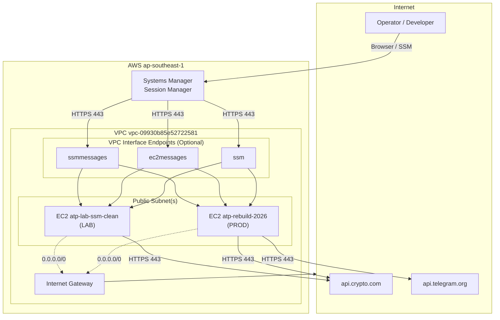
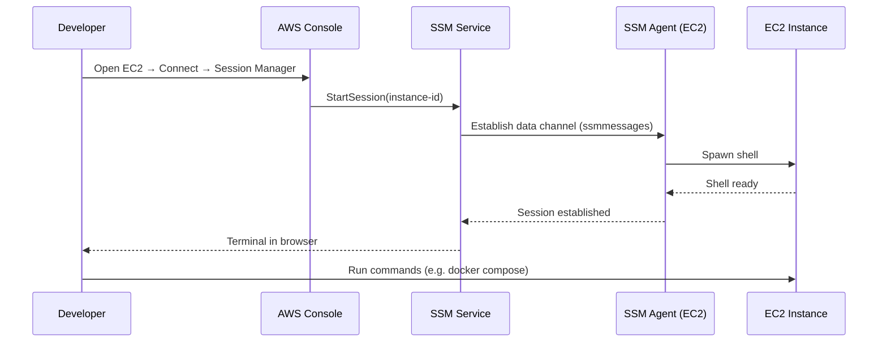

# ATP AWS Architecture

**Automated Trading Platform (ATP)** — A full-stack automated trading platform (FastAPI backend, Next.js frontend) that runs on AWS EC2 using Docker Compose. Access is SSM-first with minimal inbound exposure.

---

## 1) Overview

### What ATP Is

ATP is a Docker-based automated trading platform that connects to Crypto.com Exchange, runs signal monitoring, executes orders, and sends Telegram alerts. Production runs exclusively on AWS EC2.

### Why This Architecture

- **SSM-first access**: No inbound SSH (port 22). All operator access via AWS Systems Manager Session Manager.
- **Docker Compose on EC2**: Single EC2 host runs backend, frontend, PostgreSQL, market-updater, and observability stack.
- **Minimal inbound**: Security groups default to no inbound rules; SSM uses outbound-only connectivity from instance to AWS endpoints.

---

## 2) Environments

| Environment | Instance Name | Instance ID (example) | Purpose |
|-------------|---------------|------------------------|---------|
| **Production** | atp-rebuild-2026 | i-087953603011543c5 (or current) | Live trading, alerts, Telegram |
| **Lab** | atp-lab-ssm-clean | i-0d82c172235770a0d (or current) | Experiments, testing; may have no public IP |
| **Utility / Rescue** | atp-rescue-* | (varies) | Rescue mode for volume recovery; key: `atp-rescue-key.pem` |

### Non-Prod / Utility Instances

- **Rescue instance**: Used to mount broken root volumes, fix `authorized_keys`, recover SSH. Access via SSH with `atp-rescue-key.pem`. See `docs/audit/` runbooks.
- **Legacy / other**: Instances like "crypto 2.0", "trade_Bot" may exist; treat as non-prod unless explicitly promoted.

---

## 3) High-Level Architecture Diagram



### Sequence: Developer Connects via SSM



---

## 4) Network and Access

### How Humans Access Instances

| Method | When to Use |
|--------|-------------|
| **SSM Session Manager** | Primary. EC2 → Instances → Select → Connect → Session Manager. No SSH key required. |
| **SSH** | Fallback if SSM unavailable; requires key (e.g. `atp-rebuild-2026.pem`) and inbound 22 or EC2 Instance Connect. |

### Inbound / Outbound Rules

**Inbound (typical):**

- **SSM-only setup**: No inbound rules. Session Manager does not require inbound to the instance.
- **If ALB/HTTPS**: Add HTTPS 443 from ALB SG or specific CIDR as needed.

**Outbound (required):**

| Type | Port | Destination | Purpose |
|------|------|-------------|---------|
| HTTPS | 443 | 0.0.0.0/0 | App APIs (Crypto.com, Telegram), SSM endpoints |
| HTTP | 80 | 169.254.169.254/32 | Instance metadata (IMDS) |
| Custom TCP | 53 | 0.0.0.0/0 or VPC DNS | DNS TCP |
| Custom UDP | 53 | 0.0.0.0/0 or VPC DNS | DNS UDP |

### SSM Connectivity Options

**Option A — Public egress**

- Instance has public IP or uses NAT Gateway.
- Route table: `0.0.0.0/0` → Internet Gateway (or NAT).
- Instance reaches `*.ssm.ap-southeast-1.amazonaws.com`, `*.ec2messages.*`, `*.ssmmessages.*` over public internet.

**Option B — VPC Interface Endpoints (PrivateLink)**

- Create three endpoints: `com.amazonaws.ap-southeast-1.ssm`, `com.amazonaws.ap-southeast-1.ec2messages`, `com.amazonaws.ap-southeast-1.ssmmessages`.
- Enable Private DNS on each. Instance resolves SSM hostnames to endpoint ENIs.
- Endpoint SG must allow **inbound TCP 443 from instance SG**.
- See `docs/audit/RUNBOOK_VPC_ENDPOINTS_SSM.md`.

### Connectivity Validation Checklist

```bash
# Run on instance (via SSM)
curl -sS -m 5 -o /dev/null -w "ssm: %{http_code}\n" https://ssm.ap-southeast-1.amazonaws.com
curl -sS -m 5 -o /dev/null -w "ec2messages: %{http_code}\n" https://ec2messages.ap-southeast-1.amazonaws.com
curl -sS -m 5 -o /dev/null -w "ssmmessages: %{http_code}\n" https://ssmmessages.ap-southeast-1.amazonaws.com
curl -sS -m 5 -o /dev/null -w "api.crypto.com: %{http_code}\n" https://api.crypto.com
```

Expected: 400/404 for SSM endpoints (reachable); 200/301 for api.crypto.com. Timeout (000) = networking issue.

---

## 5) Compute Layer

### EC2 Instance Roles

| Environment | IAM Role | Policies |
|-------------|----------|----------|
| Production | EC2_SSM_Role | AmazonSSMManagedInstanceCore |
| Lab | EC2_SSM_Role or atp-lab-ssm-role | AmazonSSMManagedInstanceCore |

Trust policy must allow `ec2.amazonaws.com` to assume the role.

### Docker Compose Profile

Production uses `--profile aws`:

```bash
docker compose --profile aws ps
docker compose --profile aws up -d
```

### Services (aws profile)

| Service | Purpose |
|---------|---------|
| backend-aws | FastAPI backend (Gunicorn); trading, Telegram, health |
| frontend-aws | Next.js frontend (production build) |
| market-updater-aws | Signal monitor, price updates, alerts |
| db | PostgreSQL (container) |
| prometheus | Metrics |
| grafana | Dashboards |
| alertmanager | Alert routing |
| telegram-alerts | Alertmanager → Telegram |
| node-exporter | Host metrics |
| cadvisor | Container metrics |

### Resource Sizing

- **Instance type**: t2.micro / t3.small typical for single-host.
- **Memory limits**: backend-aws 1G, frontend-aws 512M, db default.

---

## 6) Data Layer

### PostgreSQL

- **Location**: Docker container (`db` service).
- **Volume**: `postgres_data` or `aws_postgres_data` (see docker-compose.yml).
- **No port mapping**: Database accessible only via Docker network (`db:5432`).

### Backup Strategy

- **Current**: TODO — document existing backup (e.g. pg_dump cron, EBS snapshots).
- **Proposed**: Automated daily pg_dump to S3 or EBS snapshot; retention policy.

---

## 7) Observability

### What Runs

- **Prometheus** (127.0.0.1:9090): Scrapes backend, market-updater, node-exporter, cadvisor.
- **Grafana** (127.0.0.1:3001): Dashboards; provisioned from `scripts/aws/observability/grafana/`.
- **Alertmanager** (127.0.0.1:9093): Routes alerts to telegram-alerts container.

### Logging

- **Docker logs**: `docker compose --profile aws logs -f backend-aws`
- **journald**: SSM agent, system services.
- **Centralization**: TODO — CloudWatch Logs or similar if adopted.

---

## 8) Security Model

### IAM

- **Instance profiles**: EC2_SSM_Role (or atp-lab-ssm-role) with AmazonSSMManagedInstanceCore.
- **Connector (user/role)**: Needs `ssm:StartSession`, `ssm:DescribeSessions`, `ssm:TerminateSession` to start Session Manager.
- **Least privilege**: No broad write policies on instance role.

### Secrets

- **Location**: `secrets/runtime.env` (rendered by `scripts/aws/render_runtime_env.sh`).
- **Contents**: TELEGRAM_BOT_TOKEN_AWS, TELEGRAM_CHAT_ID_AWS, CRYPTO keys, DIAGNOSTICS_API_KEY, etc.
- **Plan**: Migrate to SSM Parameter Store or Secrets Manager for production hardening.

### Security Groups

- **Inbound**: Default deny; add only what is required (e.g. ALB).
- **Outbound**: Minimal — HTTPS 443, HTTP to IMDS, DNS 53. See `docs/audit/EGRESS_HARDENING_DESIGN.md`.

### OS Hardening

- Ubuntu 24.04 LTS.
- SSM agent via snap: `snap.amazon-ssm-agent.amazon-ssm-agent.service`.
- Regular `apt update && apt upgrade`; no SSH if SSM-only.

---

## 9) Deployment and Operations

### How We Deploy Today

1. Connect via SSM Session Manager.
2. `cd /home/ubuntu/crypto-2.0`
3. `git fetch origin main && git checkout main && git pull origin main`
4. `bash scripts/aws/aws_up_backend.sh` (renders runtime.env, deploys backend)
5. Or: `docker compose --profile aws up -d --build`

### Recommended CI/CD Path

- **Option A**: GitHub Actions → SSM Send Command (e.g. `aws ssm send-command --instance-ids <id> --document-name "AWS-RunShellScript" --parameters 'commands=["cd /home/ubuntu/crypto-2.0 && git pull && bash scripts/aws/aws_up_backend.sh"]'`)
- **Option B**: CodeDeploy with EC2/On-Premises deployment type.

### Rollback

```bash
git checkout <previous-commit>
bash scripts/aws/aws_up_backend.sh
# Or: docker compose --profile aws up -d --build
```

---

## 10) Runbooks

### How to Connect (SSM)

1. AWS Console → EC2 → Instances.
2. Select instance (e.g. atp-rebuild-2026 or atp-lab-ssm-clean).
3. Connect → Session Manager tab → Connect.
4. Terminal opens; run `cd /home/ubuntu/crypto-2.0`.

**CLI alternative:**

```bash
aws ssm start-session --target <instance-id> --region ap-southeast-1
```

### How to Restart Services

```bash
cd /home/ubuntu/crypto-2.0
docker compose --profile aws restart backend-aws
# Or all: docker compose --profile aws restart
```

### How to Check Health

```bash
curl -s http://localhost:8002/health
curl -s http://localhost:8002/api/health/system
docker compose --profile aws ps
```

### How to Update Env Vars Safely

1. Edit `secrets/runtime.env` or source files used by `render_runtime_env.sh`.
2. Run `bash scripts/aws/render_runtime_env.sh`.
3. Restart affected services: `docker compose --profile aws restart backend-aws market-updater-aws`.

### How to Troubleshoot SSM Offline

See `docs/audit/SSM_SESSION_MANAGER_CONNECTIVITY_AUDIT.md`. Quick checks:

```bash
# On instance (if reachable via SSH/EC2 Instance Connect)
sudo systemctl status snap.amazon-ssm-agent.amazon-ssm-agent.service
curl -s http://169.254.169.254/latest/meta-data/iam/security-credentials/
curl -sS -m 5 -o /dev/null -w "%{http_code}\n" https://ssm.ap-southeast-1.amazonaws.com
```

---

## 11) Appendix

### Naming Conventions

| Resource | Pattern | Example |
|----------|---------|---------|
| PROD instance | atp-rebuild-* | atp-rebuild-2026 |
| LAB instance | atp-lab-* | atp-lab-ssm-clean |
| Rescue instance | atp-rescue-* | (varies) |
| Security group (PROD) | atp-prod-sg | TODO |
| Security group (LAB) | atp-lab-sg | TODO |
| SSM role | EC2_SSM_Role, atp-lab-ssm-role | — |

### Ports / Services Table

| Port | Service | Bind | Notes |
|------|---------|------|-------|
| 8002 | backend-aws | 127.0.0.1 | Internal only |
| 3000 | frontend-aws | 127.0.0.1 | Internal only |
| 5432 | db | (none) | Docker network only |
| 9090 | prometheus | 127.0.0.1 | Internal |
| 3001 | grafana | 127.0.0.1 | Internal (Grafana HTTP port 3000) |
| 9093 | alertmanager | 127.0.0.1 | Internal |
| 9100 | node-exporter | 127.0.0.1 | Internal |
| 8080 | cadvisor | 127.0.0.1 | Internal |

Public access (if any) via ALB/reverse proxy; not direct to these ports.

### Required AWS Services

- EC2
- VPC (subnets, route tables, Internet Gateway)
- IAM (roles, instance profiles)
- Systems Manager (Session Manager, Run Command)
- (Optional) VPC Interface Endpoints for SSM
- (Optional) S3, CloudWatch for backups/logs
