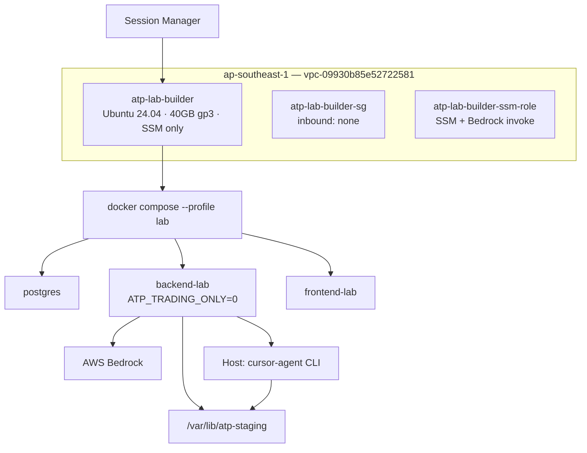

# LAB Bootstrap Runbook — Jarvis Builder Mode Phase 2A

**Instance:** `atp-lab-builder`  
**Purpose:** Dedicated LAB host for Jarvis Builder (staging git, diff, tests, PR prep) — no trading, no PROD secrets, no deploy to PROD.  
**Status:** Plan / runbook — execute only after operator review and approval.

> **Hard rules when executing this runbook**
>
> - Do **not** copy PROD secrets (`secrets/runtime.env` from atp-rebuild-2026, PROD SSM paths under `/automated-trading-platform/prod/*`).
> - Do **not** modify PROD (`i-087953603011543c5`) or its security groups.
> - Do **not** enable trading execution on this host.
> - Do **not** run `scripts/aws/render_runtime_env.sh` against PROD SSM on the builder LAB.

**Related docs:**

- [JARVIS_CONTROL_CENTER_IMPLEMENTATION_PLAN.md](../architecture/JARVIS_CONTROL_CENTER_IMPLEMENTATION_PLAN.md) — Phase 2 (Builder)
- [RUNBOOK_ARCH_B_PROD_LAB.md](../audit/RUNBOOK_ARCH_B_PROD_LAB.md) — VPC, subnet, SG patterns
- [CURSOR_EXECUTION_BRIDGE_DESIGN.md](../architecture/CURSOR_EXECUTION_BRIDGE_DESIGN.md) — staging + Cursor CLI
- [BACKEND_AWS_CANONICAL_REPO.md](../operations/BACKEND_AWS_CANONICAL_REPO.md) — repo path conventions

**Relationship to existing LAB:** `atp-lab-ssm-clean` (i-0d82c172235770a0d) remains OpenClaw-only. `atp-lab-builder` is a **new** instance dedicated to Jarvis Builder Phase 2A.

---

## Scope and boundaries

| Rule | How this runbook honors it |
|------|----------------------------|
| No PROD changes | Separate instance, SG, IAM role, secrets; no PROD env copy |
| No trading execution | `TRADING_ENABLED=false`, `LIVE_TRADING=false`, `RUN_SIGNAL_MONITOR=false` |
| No PROD trading secrets | LAB-only `secrets/runtime.env.lab`; never run PROD render scripts |
| SSM-only access | Security group has **no public inbound SSH** |

---

## Architecture (target)



---

## Prerequisites (operator workstation)

```bash
export AWS_REGION=ap-southeast-1
export AWS_PAGER=""

# Confirm account / region
aws sts get-caller-identity
aws configure get region   # expect ap-southeast-1

# Fixed network IDs (from docs/audit/RUNBOOK_ARCH_B_PROD_LAB.md)
export ATP_VPC_ID=vpc-09930b85e52722581
export ATP_LAB_SUBNET=subnet-055b8b41048d648aa   # ap-southeast-1c
```

---

## Step-by-step runbook

### Phase 0 — Preflight

1. Confirm PROD is untouched: do **not** use this runbook on `i-087953603011543c5` (atp-rebuild-2026).
2. Resolve Ubuntu 24.04 AMI (store for launch step):

```bash
export UBUNTU_2404_AMI=$(
  aws ec2 describe-images \
    --region "$AWS_REGION" \
    --owners 099720109477 \
    --filters "Name=name,Values=ubuntu/images/hvm-ssd-gp3/ubuntu-noble-24.04-amd64-server-*" \
              "Name=state,Values=available" \
    --query 'sort_by(Images, &CreationDate)[-1].ImageId' \
    --output text
)
echo "AMI: $UBUNTU_2404_AMI"
```

3. Decide instance size: **t3.small** (minimum) or **t3.medium** (recommended for Docker builds + pytest).

---

### Phase 1 — IAM role + instance profile

**Minimum:** `AmazonSSMManagedInstanceCore`  
**Phase 2A add-on:** Bedrock `InvokeModel` (Jarvis Builder uses Bedrock, not OpenClaw)

```bash
# 1a) Trust policy
cat > /tmp/atp-lab-builder-trust.json <<'EOF'
{
  "Version": "2012-10-17",
  "Statement": [{
    "Effect": "Allow",
    "Principal": { "Service": "ec2.amazonaws.com" },
    "Action": "sts:AssumeRole"
  }]
}
EOF

# 1b) Create role
aws iam create-role \
  --role-name atp-lab-builder-ssm-role \
  --assume-role-policy-document file:///tmp/atp-lab-builder-trust.json \
  --description "LAB atp-lab-builder: SSM + Bedrock for Jarvis Builder"

# 1c) SSM core
aws iam attach-role-policy \
  --role-name atp-lab-builder-ssm-role \
  --policy-arn arn:aws:iam::aws:policy/AmazonSSMManagedInstanceCore

# 1d) Bedrock invoke (Phase 2A — restrict model ARNs in prod policy review)
cat > /tmp/atp-lab-builder-bedrock.json <<'EOF'
{
  "Version": "2012-10-17",
  "Statement": [{
    "Sid": "JarvisBuilderBedrockInvoke",
    "Effect": "Allow",
    "Action": ["bedrock:InvokeModel", "bedrock:InvokeModelWithResponseStream"],
    "Resource": "*"
  }]
}
EOF

aws iam put-role-policy \
  --role-name atp-lab-builder-ssm-role \
  --policy-name atp-lab-builder-bedrock-invoke \
  --policy-document file:///tmp/atp-lab-builder-bedrock.json

# 1e) Instance profile (required for EC2 attach)
aws iam create-instance-profile --instance-profile-name atp-lab-builder-ssm-role
aws iam add-role-to-instance-profile \
  --instance-profile-name atp-lab-builder-ssm-role \
  --role-name atp-lab-builder-ssm-role
```

---

### Phase 2 — Security group (no public inbound SSH)

```bash
# 2a) Create SG — inbound empty (SSM is outbound-only from instance)
export BUILDER_SG_ID=$(
  aws ec2 create-security-group \
    --region "$AWS_REGION" \
    --group-name atp-lab-builder-sg \
    --description "LAB atp-lab-builder — SSM only, no public inbound" \
    --vpc-id "$ATP_VPC_ID" \
    --query GroupId --output text
)
echo "SG: $BUILDER_SG_ID"

# 2b) Remove default allow-all egress, then add minimal outbound
aws ec2 revoke-security-group-egress \
  --group-id "$BUILDER_SG_ID" \
  --ip-permissions IpProtocol=-1,IpRanges='[{CidrIp=0.0.0.0/0}]' \
  2>/dev/null || true

aws ec2 authorize-security-group-egress --group-id "$BUILDER_SG_ID" --ip-permissions \
  '[{"IpProtocol":"tcp","FromPort":443,"ToPort":443,"IpRanges":[{"CidrIp":"0.0.0.0/0","Description":"HTTPS"}]},
    {"IpProtocol":"tcp","FromPort":80,"ToPort":80,"IpRanges":[{"CidrIp":"0.0.0.0/0","Description":"apt bootstrap"}]},
    {"IpProtocol":"tcp","FromPort":80,"ToPort":80,"IpRanges":[{"CidrIp":"169.254.169.254/32","Description":"IMDS"}]},
    {"IpProtocol":"tcp","FromPort":53,"ToPort":53,"IpRanges":[{"CidrIp":"0.0.0.0/0","Description":"DNS TCP"}]},
    {"IpProtocol":"udp","FromPort":53,"ToPort":53,"IpRanges":[{"CidrIp":"0.0.0.0/0","Description":"DNS UDP"}]}]'

# Verify: inbound must be empty
aws ec2 describe-security-groups --group-ids "$BUILDER_SG_ID" \
  --query 'SecurityGroups[0].{Inbound:IpPermissions,Outbound:IpPermissionsEgress}'
```

**Optional hardening (post-bootstrap):** remove outbound `HTTP 80 → 0.0.0.0/0` after apt/Docker/Node installs (keep IMDS 80 rule).

---

### Phase 3 — Launch EC2 (Ubuntu 24.04, 40 GB gp3, SSM, tagged)

```bash
export BUILDER_INSTANCE_ID=$(
  aws ec2 run-instances \
    --region "$AWS_REGION" \
    --image-id "$UBUNTU_2404_AMI" \
    --instance-type t3.medium \
    --subnet-id "$ATP_LAB_SUBNET" \
    --security-group-ids "$BUILDER_SG_ID" \
    --iam-instance-profile Name=atp-lab-builder-ssm-role \
    --no-associate-public-ip-address \
    --block-device-mappings '[
      {
        "DeviceName": "/dev/sda1",
        "Ebs": {
          "VolumeSize": 40,
          "VolumeType": "gp3",
          "DeleteOnTermination": true,
          "Encrypted": true
        }
      }
    ]' \
    --metadata-options "HttpTokens=required,HttpEndpoint=enabled,HttpPutResponseHopLimit=2" \
    --tag-specifications \
      'ResourceType=instance,Tags=[{Key=Name,Value=atp-lab-builder},{Key=Environment,Value=lab},{Key=Purpose,Value=jarvis-builder-phase-2a},{Key=Project,Value=atp}]' \
    --query 'Instances[0].InstanceId' \
    --output text
)
echo "Instance: $BUILDER_INSTANCE_ID"

aws ec2 wait instance-running --instance-ids "$BUILDER_INSTANCE_ID"

# Wait for SSM Online (up to ~5 min)
for i in $(seq 1 30); do
  STATUS=$(aws ssm describe-instance-information \
    --filters "Key=InstanceIds,Values=$BUILDER_INSTANCE_ID" \
    --query 'InstanceInformationList[0].PingStatus' --output text 2>/dev/null || echo "None")
  echo "SSM ping: $STATUS (attempt $i)"
  [[ "$STATUS" == "Online" ]] && break
  sleep 10
done
```

**Access:** EC2 → Instances → `atp-lab-builder` → Connect → **Session Manager** (no SSH key, no public inbound 22).

Record instance ID and private IP in `docs/audit/LAB_BOOTSTRAP_EVIDENCE.md` (copy template, rename section for `atp-lab-builder`).

---

### Phase 4 — Host bootstrap (run on instance via SSM)

Connect via Session Manager, then run in order.

#### 4.1 Base packages

```bash
sudo apt-get update -y
sudo apt-get install -y \
  git ca-certificates curl unzip jq \
  build-essential
```

#### 4.2 Docker (official repo)

```bash
sudo install -m 0755 -d /etc/apt/keyrings
curl -fsSL https://download.docker.com/linux/ubuntu/gpg | \
  sudo gpg --dearmor -o /etc/apt/keyrings/docker.gpg
sudo chmod a+r /etc/apt/keyrings/docker.gpg

echo "deb [arch=$(dpkg --print-architecture) signed-by=/etc/apt/keyrings/docker.gpg] \
  https://download.docker.com/linux/ubuntu $(. /etc/os-release && echo "$VERSION_CODENAME") stable" | \
  sudo tee /etc/apt/sources.list.d/docker.list > /dev/null

sudo apt-get update -y
sudo apt-get install -y docker-ce docker-ce-cli containerd.io docker-compose-plugin
sudo usermod -aG docker ubuntu
sudo systemctl enable --now docker
docker --version
docker compose version
```

Log out/in of SSM session (or `newgrp docker`) before running compose as `ubuntu`.

#### 4.3 Node.js 22

```bash
curl -fsSL https://deb.nodesource.com/setup_22.x | sudo -E bash -
sudo apt-get install -y nodejs
node -v    # expect v22.x
npm -v
```

#### 4.4 Cursor CLI (if available)

Per [Cursor CLI docs](https://cursor.com/docs/cli/headless):

```bash
curl https://cursor.com/install -fsS | bash
echo 'export PATH="$HOME/.local/bin:$PATH"' >> ~/.bashrc
source ~/.bashrc

# New CLI binary name may be cursor-agent or agent; bridge expects CURSOR_CLI_PATH=cursor
if command -v cursor-agent >/dev/null 2>&1; then
  ln -sf "$(command -v cursor-agent)" ~/.local/bin/cursor
elif command -v agent >/dev/null 2>&1; then
  ln -sf "$(command -v agent)" ~/.local/bin/cursor
fi

cursor --version 2>/dev/null || cursor-agent --version
agent status 2>/dev/null || true
```

**Headless auth (required for bridge automation):** set `CURSOR_API_KEY` in LAB secrets only — generate from Cursor Dashboard → API Keys. Do **not** copy from PROD.

#### 4.5 Staging + repo layout

```bash
sudo mkdir -p /var/lib/atp-staging
sudo chown ubuntu:ubuntu /var/lib/atp-staging
chmod 755 /var/lib/atp-staging

cd /home/ubuntu
git clone https://github.com/ccruz0/crypto-2.0.git crypto-2.0
cd /home/ubuntu/crypto-2.0
git checkout main
git pull origin main
```

**Clone command (canonical):**

```bash
git clone https://github.com/ccruz0/crypto-2.0.git /home/ubuntu/crypto-2.0
```

---

### Phase 5 — LAB environment files

Create **LAB-only** env files (never copy PROD `secrets/runtime.env` or `.env.aws`).

#### 5.1 `secrets/runtime.env.lab` (template)

Fill Bedrock, GitHub, and Cursor values from LAB-scoped sources only. Placeholders below are intentional — do not commit real secrets.

```bash
cat > /home/ubuntu/crypto-2.0/secrets/runtime.env.lab <<'EOF'
# LAB atp-lab-builder — Jarvis Builder Phase 2A
# DO NOT copy PROD values from SSM or atp-rebuild-2026

ENVIRONMENT=lab
APP_ENV=lab
RUNTIME_ORIGIN=LAB
JARVIS_ENV=lab

# Trading isolation (required)
ATP_TRADING_ONLY=0
TRADING_ENABLED=false
LIVE_TRADING=false
RUN_SIGNAL_MONITOR=false
RUN_TELEGRAM=false
RUN_TELEGRAM_POLLER=false

# Jarvis Builder
JARVIS_ENABLED=true
JARVIS_BUILDER_ALLOWED=1
JARVIS_CONTROL_ENABLED=1
JARVIS_DRY_RUN_ONLY=false

# Cursor Execution Bridge
CURSOR_BRIDGE_ENABLED=true
CURSOR_BRIDGE_REQUIRE_APPROVAL=true
CURSOR_BRIDGE_AUTO_IN_ADVANCE=false
CURSOR_CLI_PATH=cursor
ATP_STAGING_ROOT=/var/lib/atp-staging

# Bedrock (LAB-scoped — fill from LAB SSM or manual)
JARVIS_BEDROCK_REGION=us-east-1
JARVIS_BEDROCK_MODEL_ID=anthropic.claude-3-5-sonnet-20241022-v2:0

# Database (local compose)
DATABASE_URL=postgresql://trader:labtraderpass@db:5432/atp

# GitHub (LAB GitHub App or PAT — NOT prod PAT)
# GITHUB_APP_ID=
# GITHUB_APP_INSTALLATION_ID=
# GITHUB_APP_PRIVATE_KEY_B64=
GITHUB_REPOSITORY=ccruz0/crypto-2.0

# Explicitly empty — no prod Telegram
TELEGRAM_BOT_TOKEN=
TELEGRAM_CHAT_ID=
TELEGRAM_ATP_CONTROL_BOT_TOKEN=
TELEGRAM_ATP_CONTROL_CHAT_ID=

# No exchange credentials on builder LAB
USE_CRYPTO_PROXY=false
EXECUTION_CONTEXT=LAB
EOF

chmod 600 /home/ubuntu/crypto-2.0/secrets/runtime.env.lab
cp /home/ubuntu/crypto-2.0/secrets/runtime.env.lab /home/ubuntu/crypto-2.0/secrets/runtime.env
```

#### 5.2 `.env` + `.env.lab` (compose interpolation)

```bash
cat > /home/ubuntu/crypto-2.0/.env <<'EOF'
POSTGRES_DB=atp
POSTGRES_USER=trader
POSTGRES_PASSWORD=labtraderpass
DATABASE_URL=postgresql://trader:labtraderpass@db:5432/atp
ENVIRONMENT=lab
APP_ENV=lab
RUNTIME_ORIGIN=LAB
ATP_TRADING_ONLY=0
TRADING_ENABLED=false
LIVE_TRADING=false
RUN_TELEGRAM=false
RUN_SIGNAL_MONITOR=false
RUN_TELEGRAM_POLLER=false
DISABLE_AUTH=true
EOF

cat > /home/ubuntu/crypto-2.0/.env.lab <<'EOF'
# Jarvis Builder LAB overlay
JARVIS_ENV=lab
JARVIS_BUILDER_ALLOWED=1
CURSOR_BRIDGE_ENABLED=true
ATP_STAGING_ROOT=/var/lib/atp-staging
EOF
```

**Note:** `JARVIS_BUILDER_ALLOWED` is specified in the implementation plan; code wiring may land in Phase 2A implementation PRs. Until then, `ATP_TRADING_ONLY=0` is the effective gate for agent routes, Cursor bridge startup, and `repo_worker_mvp`.

---

### Phase 6 — Proposed `docker-compose.lab.yml` (or `--profile lab`)

**Recommendation:** add `docker-compose.lab.yml` as a compose override (future PR) rather than overloading the `aws` profile. Minimum services: `db`, `backend-lab`, `frontend-lab`. Exclude `market-updater-aws`, observability stack, and canary.

```yaml
# PROPOSED — not in repo until Phase 2A implementation PR
# Usage: docker compose -f docker-compose.yml -f docker-compose.lab.yml --profile lab up -d

name: automated-trading-platform-lab

services:
  db:
    profiles: [lab]

  backend-lab:
    build:
      context: .
      dockerfile: backend/Dockerfile.aws
    env_file:
      - .env
      - .env.lab
      - ./secrets/runtime.env
    environment:
      ENVIRONMENT: lab
      APP_ENV: lab
      RUNTIME_ORIGIN: LAB
      ATP_TRADING_ONLY: "0"
      TRADING_ENABLED: "false"
      LIVE_TRADING: "false"
      RUN_SIGNAL_MONITOR: "false"
      RUN_TELEGRAM: "false"
      RUN_TELEGRAM_POLLER: "false"
      JARVIS_ENV: lab
      JARVIS_ENABLED: "true"
      JARVIS_BUILDER_ALLOWED: "1"
      CURSOR_BRIDGE_ENABLED: "true"
      CURSOR_BRIDGE_REQUIRE_APPROVAL: "true"
      ATP_STAGING_ROOT: /var/lib/atp-staging
      DISABLE_AUTH: "true"
      USE_CRYPTO_PROXY: "false"
      EXECUTION_CONTEXT: LAB
      API_BASE_URL: http://backend-lab:8002
    ports:
      - "127.0.0.1:8002:8002"
    volumes:
      - /var/run/docker.sock:/var/run/docker.sock
      - ./.git:/app/.git:ro
      - /var/lib/atp-staging:/var/lib/atp-staging
      - /home/ubuntu/.local/bin/cursor:/usr/local/bin/cursor:ro
      - ./secrets:/app/secrets
      - ./docs:/app/docs
      - ./logs:/app/logs
    depends_on:
      db:
        condition: service_healthy
    profiles: [lab]

  frontend-lab:
    build:
      context: ./frontend
      dockerfile: Dockerfile.dev
    environment:
      NODE_ENV: development
      NEXT_PUBLIC_API_URL: http://localhost:8002/api
      NEXT_PUBLIC_ENVIRONMENT: lab
    ports:
      - "127.0.0.1:3000:3000"
    depends_on:
      backend-lab:
        condition: service_healthy
    profiles: [lab]
```

**Until `docker-compose.lab.yml` exists**, validate env and compose syntax only:

```bash
cd /home/ubuntu/crypto-2.0
docker compose --profile local config >/dev/null && echo "compose syntax OK"
# Do NOT run --profile aws on this host
```

---

## Required LAB env (Phase 2A spec)

| Variable | Value |
|----------|-------|
| `ATP_TRADING_ONLY` | `0` |
| `TRADING_ENABLED` | `false` |
| `LIVE_TRADING` | `false` |
| `RUN_SIGNAL_MONITOR` | `false` |
| `RUN_TELEGRAM` | `false` |
| `RUN_TELEGRAM_POLLER` | `false` |
| `CURSOR_BRIDGE_ENABLED` | `true` |
| `CURSOR_BRIDGE_REQUIRE_APPROVAL` | `true` |
| `ATP_STAGING_ROOT` | `/var/lib/atp-staging` |
| `JARVIS_BUILDER_ALLOWED` | `1` |

---

## Verification checklist

Run on `atp-lab-builder` via Session Manager after bootstrap.

### A. Infrastructure

| # | Check | Command | Expected |
|---|--------|---------|----------|
| A1 | Ubuntu 24.04 | `uname -a` | `noble` / 24.04 kernel |
| A2 | SSM Online | AWS Console → Instance → Session Manager | Online |
| A3 | No public IP | `curl -s --max-time 2 http://169.254.169.254/latest/meta-data/public-ipv4 \|\| echo none` | empty / timeout |
| A4 | SG inbound | `aws ec2 describe-security-groups --group-ids $BUILDER_SG_ID` | `IpPermissions: []` |
| A5 | Disk 40 GB | `lsblk` / `df -h /` | ~40G root |

### B. Toolchain

| # | Check | Command | Expected |
|---|--------|---------|----------|
| B1 | Docker | `docker info >/dev/null && echo OK` | OK |
| B2 | Compose | `docker compose version` | v2 plugin |
| B3 | Git | `git --version` | installed |
| B4 | Node 22 | `node -v` | v22.x |
| B5 | Cursor CLI | `cursor --version \|\| cursor-agent --version` | version string |
| B6 | Staging writable | `touch /var/lib/atp-staging/.write-test && rm /var/lib/atp-staging/.write-test` | success |

### C. Repo + env isolation

| # | Check | Command | Expected |
|---|--------|---------|----------|
| C1 | Repo present | `test -d /home/ubuntu/crypto-2.0/.git && echo OK` | OK |
| C2 | No prod Telegram | `grep -E 'TELEGRAM.*=' secrets/runtime.env \| grep -v '=$' \|\| echo clean` | empty or only comments |
| C3 | Trading flags | `grep -E 'ATP_TRADING_ONLY\|TRADING_ENABLED\|LIVE_TRADING' secrets/runtime.env` | `0` / `false` / `false` |
| C4 | Bridge flags | `grep CURSOR_BRIDGE secrets/runtime.env` | enabled + require approval |
| C5 | Staging root | `grep ATP_STAGING_ROOT secrets/runtime.env` | `/var/lib/atp-staging` |

### D. Application (after compose lab profile is implemented)

| # | Check | Command | Expected |
|---|--------|---------|----------|
| D1 | Health | `curl -sf http://127.0.0.1:8002/api/health/ready` | HTTP 200 |
| D2 | Trading-only off | `curl -sf http://127.0.0.1:8002/api/admin/runtime-status 2>/dev/null \| jq .atp_trading_only` | `false` |
| D3 | Jarvis enabled | `curl -sf -X POST http://127.0.0.1:8002/api/jarvis/task -H 'Content-Type: application/json' -d '{"prompt":"ping","dry_run":true}'` | task response (not disabled) |
| D4 | No signal monitor | `docker compose logs backend-lab 2>&1 \| grep -i signal_monitor \| tail -3` | no active trading loop |
| D5 | Staging provision | manual Builder task or `provision_staging_workspace` test | dir under `/var/lib/atp-staging/atp-*` |

### E. Negative tests (must pass)

| # | Check | Expected |
|---|--------|----------|
| E1 | No PROD SSM params on instance | `grep -r '/automated-trading-platform/prod' secrets/ \|\| echo clean` |
| E2 | No exchange keys | `grep -E 'EXCHANGE_CUSTOM_API|CRYPTO.*SECRET' secrets/runtime.env` | unset or empty |
| E3 | PROD instance unchanged | PROD `ATP_TRADING_ONLY` still `1` | verify separately on PROD |

### F. SSM connectivity smoke (from RUNBOOK_ARCH_B)

```bash
uname -a
whoami
curl -sI https://api.telegram.org | head
getent hosts api.telegram.org
curl -s https://api.ipify.org ; echo
```

Expected: outbound HTTPS and DNS work; Telegram headers return (connectivity only — Telegram remains disabled via env).

---

## Rollback / delete commands

**Order matters:** terminate instance before deleting SG; detach policies before deleting role.

```bash
# Set if not still in shell
export AWS_REGION=ap-southeast-1
export BUILDER_INSTANCE_ID=i-xxxxxxxxxxxxxxxxx   # fill after launch
export BUILDER_SG_ID=sg-xxxxxxxxxxxxxxxxx

# 1) Stop any local compose (on instance via SSM)
cd /home/ubuntu/crypto-2.0
docker compose -f docker-compose.yml -f docker-compose.lab.yml --profile lab down -v 2>/dev/null || true

# 2) Terminate instance (irreversible)
aws ec2 terminate-instances --region "$AWS_REGION" --instance-ids "$BUILDER_INSTANCE_ID"
aws ec2 wait instance-terminated --region "$AWS_REGION" --instance-ids "$BUILDER_INSTANCE_ID"

# 3) Delete security group
aws ec2 delete-security-group --region "$AWS_REGION" --group-id "$BUILDER_SG_ID"

# 4) Delete IAM instance profile + role
aws iam remove-role-from-instance-profile \
  --instance-profile-name atp-lab-builder-ssm-role \
  --role-name atp-lab-builder-ssm-role
aws iam delete-instance-profile --instance-profile-name atp-lab-builder-ssm-role

aws iam delete-role-policy \
  --role-name atp-lab-builder-ssm-role \
  --policy-name atp-lab-builder-bedrock-invoke

aws iam detach-role-policy \
  --role-name atp-lab-builder-ssm-role \
  --policy-arn arn:aws:iam::aws:policy/AmazonSSMManagedInstanceCore

aws iam delete-role --role-name atp-lab-builder-ssm-role

# 5) Optional: release unattached EBS if DeleteOnTermination was false
aws ec2 describe-volumes \
  --filters "Name=tag:Name,Values=atp-lab-builder" \
  --query 'Volumes[*].VolumeId' --output text
# aws ec2 delete-volume --volume-id vol-xxxxxxxx
```

**PROD safety:** none of these commands reference `i-087953603011543c5` or PROD security groups.

---

## Implementation follow-ups (after bootstrap approved)

1. **PR:** add `docker-compose.lab.yml` + `--profile lab` to root compose docs.
2. **PR:** implement `JARVIS_BUILDER_ALLOWED` gate in control service (planned in architecture doc).
3. **Secrets:** store LAB Bedrock/GitHub/Cursor keys in SSM prefix `/automated-trading-platform/lab/builder/*` — not `/prod/*`.
4. **Access:** optional VPC-internal nginx or SSM port-forward for dashboard testing — no public 80/443 on builder host unless explicitly required.
5. **Cost review:** t3.medium + 40 GB gp3; terminate when idle.
6. **Evidence:** capture screenshots and command output per `docs/audit/LAB_BOOTSTRAP_EVIDENCE.md`.

---

## Sign-off

| Item | Done | Operator | Date |
|------|------|----------|------|
| IAM role + instance profile created | | | |
| Security group created (no inbound SSH) | | | |
| Instance launched and tagged `atp-lab-builder` | | | |
| SSM Online verified | | | |
| Host toolchain installed (Docker, Git, Node 22, Cursor CLI) | | | |
| Repo cloned to `/home/ubuntu/crypto-2.0` | | | |
| LAB env files created (no PROD secrets) | | | |
| Verification checklist passed | | | |
| PROD confirmed unchanged | | | |
